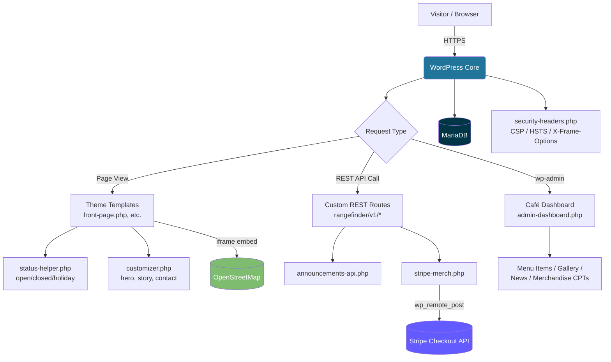
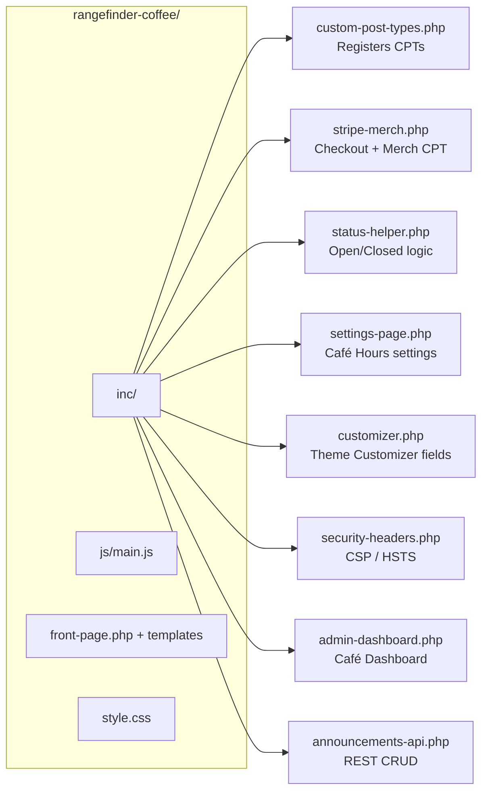
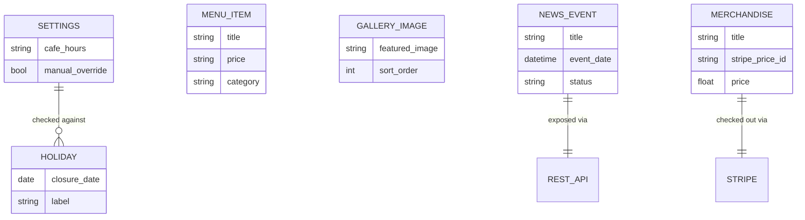
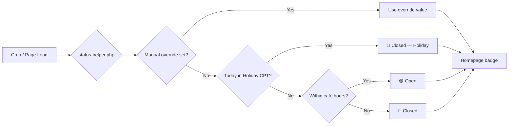
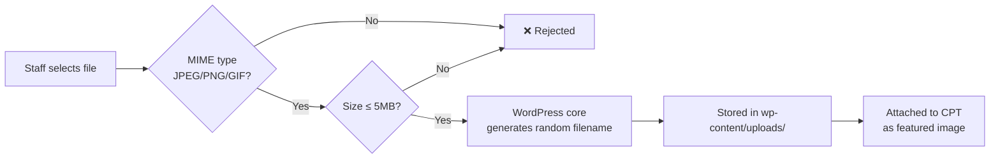
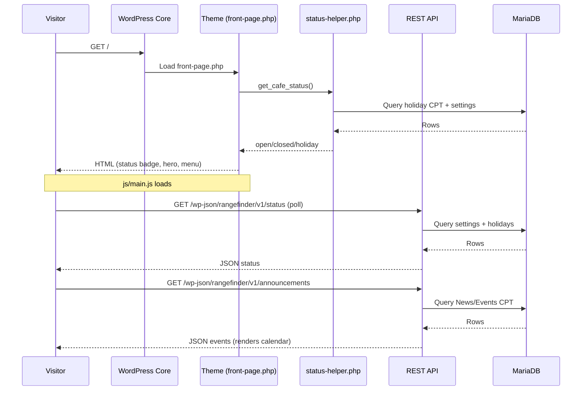
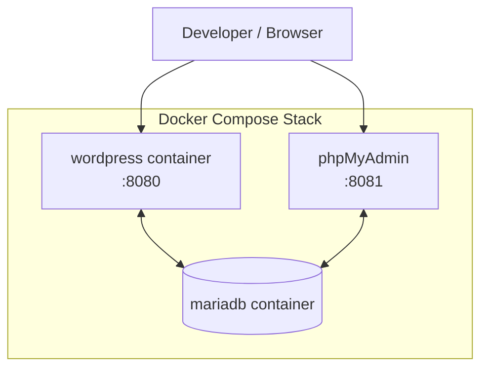

<div align="center">

# ☕ Range Finder Coffee — WordPress Theme

**A zero-build-tool, browser-managed WordPress theme for a real café run by real (non-developer) staff.**

[](#tech-stack)
[](#tech-stack)
[](#tech-stack)
[](#tech-stack)
[](#accessibility-wcag-21-aa)
[](#security)
[](#requirements)
[](#requirements)
[](#license)

</div>

---

## 📘 Table of Contents

1. [Overview](#overview)
2. [At a Glance](#at-a-glance)
3. [Architecture](#architecture)
4. [Project Structure](#project-structure)
5. [Browser-Based CMS](#browser-based-cms)
6. [Admin Dashboard](#admin-dashboard)
7. [Content Model](#content-model)
8. [Accessibility (WCAG 2.1 AA)](#accessibility-wcag-21-aa)
9. [Security](#security)
10. [Holiday Closures & Live Status](#holiday-closures--live-status)
11. [Soft-Delete Recycle Bin](#soft-delete-recycle-bin)
12. [Image Upload Pipeline](#image-upload-pipeline)
13. [Audit Logging](#audit-logging)
14. [Automatic Backups](#automatic-backups)
15. [Interactive Event Calendar](#interactive-event-calendar)
16. [Branch Maps (OpenStreetMap)](#branch-maps-openstreetmap)
17. [System Tools & Roadmap](#system-tools--roadmap)
18. [Tech Stack](#tech-stack)
19. [Announcements / Events REST API](#announcements--events-rest-api)
20. [Request Lifecycle](#request-lifecycle)
21. [Local Setup (Docker)](#local-setup-docker)
22. [Local Setup (Without Docker)](#local-setup-without-docker)
23. [Environment Variables](#environment-variables)
24. [Browser Support](#browser-support)
25. [Contributing / Dev Workflow](#contributing--dev-workflow)
26. [Glossary](#glossary)
27. [FAQ](#faq)
28. [Requirements](#requirements)
29. [License](#license)

---

## Overview

**Range Finder Coffee** is a custom WordPress theme built for a single-location café in Fayetteville, WV. It intentionally avoids the modern front-end tooling stack — no Bootstrap, no Node, no bundler, no build step. Instead it leans entirely on:

- Plain PHP templates
- One CSS file using native custom properties (CSS variables) for instant contrast/font scaling
- One vanilla JavaScript file

The guiding constraint is that **the people running the café are not developers**. Every piece of content — menu items, gallery photos, announcements, merchandise, hours — is editable from the browser through native WordPress admin screens and a single custom **Café Dashboard**, with no FTP, no Git, and no command line required for day-to-day operation.

WordPress core is treated as the application platform, not just a CMS wrapper — it already solves authentication, sessions, the admin UI, media handling, REST, and database access securely. This theme's code exists **only** to add the café-specific behavior WordPress doesn't ship with out of the box.

> [!NOTE]
> This repo does **not** include WordPress core (`wp-admin/`, `wp-includes/`, `wp-load.php`). Docker Compose runs the official `wordpress` image, which generates `wp-config.php` from environment variables and stores core files in a named volume. Only `wp-content/` is bind-mounted from this repository.

---

## At a Glance

| | |
|---|---|
| **Type** | WordPress theme (`wp-content/themes/rangefinder-coffee/`) |
| **Audience** | Non-technical café staff (content) + developers (theme code) |
| **Front-end tooling** | None — no Node, no bundler, no framework |
| **Payments** | Stripe Checkout via `wp_remote_post` (no SDK) |
| **Maps** | OpenStreetMap embeds (no Google Maps API key needed) |
| **Local dev** | Docker Compose (WordPress + MariaDB + phpMyAdmin) |
| **Custom REST namespace** | `/wp-json/rangefinder/v1/` |

---

## Architecture

High-level view of how a request flows through the stack — WordPress core handles the heavy lifting, the theme layers café-specific logic on top.



---

## Project Structure

```
wp-content/
├── themes/
│   └── rangefinder-coffee/        # Theme — the main project
│       ├── inc/
│       │   ├── custom-post-types.php
│       │   ├── stripe-merch.php
│       │   ├── status-helper.php
│       │   ├── settings-page.php
│       │   ├── customizer.php
│       │   ├── security-headers.php
│       │   ├── admin-dashboard.php
│       │   └── announcements-api.php
│       ├── js/
│       │   └── main.js
│       ├── front-page.php
│       └── style.css
├── plugins/                       # Drop-in third-party plugins (empty by default)
├── mu-plugins/                    # Must-use plugins (empty by default)
└── uploads/                       # Media uploads (gitignored contents)

docker-compose.yml                 # Local WordPress + MariaDB + phpMyAdmin stack
docker/php/uploads.ini             # PHP upload-size overrides
docker/php/security.ini            # expose_php = Off, etc.
Makefile                           # docker compose / wp-cli shortcuts
.env.example                       # Template for local environment variables
```

<details>
<summary><strong>📂 Expand: annotated file tree with responsibilities</strong></summary>



</details>

---

## Browser-Based CMS

Staff manage all content through the **Café Dashboard** and native WordPress admin screens — no FTP, no Git, no CLI.

| Feature | Description | Who Uses It | Status |
|---|---|---|---|
| Dashboard SPA | Live status, Stripe check, content counts | Staff | ✅ Live |
| Menu Items | Add/edit/delete menu items and prices | Staff | ✅ Live |
| Gallery Images | Homepage slider photos | Staff | ✅ Live |
| News / Events | Announcements + calendar events | Staff | ✅ Live |
| Merchandise | Stripe Checkout items | Staff | ✅ Live |

**Explanation**: The Café Dashboard provides a single-page application (SPA) where staff can manage all content without needing to use FTP, Git, or the command line. This ensures that non-technical staff can easily update menu items, gallery images, news/events, and merchandise directly from their browser.

---

## Admin Dashboard

Activating the theme adds a **Café Dashboard** page (`inc/admin-dashboard.php`) to the top of the wp-admin sidebar — one screen summarizing live status, Stripe configuration, and quick-links into every content type staff manage. No separate custom backend is needed since WordPress admin already covers CRUD, media, and permissions.

| Section | Icon | What You Can Do |
|---|---|---|
| Live Status | 🟢/🔴 | See the current computed open/closed/holiday badge at a glance |
| Stripe Checkout | 💳 | See whether Stripe keys are configured, with a direct link to add them if not |
| Menu Items | ☕ | Add/edit/delete top menu items and prices shown on the homepage |
| Gallery Images | 🖼️ | Manage homepage picture-slider images (set a featured image per slide) |
| News / Events | 📰 | Post announcements/events shown in the homepage news feed |
| Merchandise | 🛒 | Manage items sold via Stripe Checkout on the homepage |

**Explanation**: The Admin Dashboard provides a centralized interface for staff to manage various aspects of the café, including live status, Stripe configuration, menu items, gallery images, news/events, and merchandise. This ensures that all necessary information is easily accessible in one place.

---

## Content Model

How the custom post types relate to each other and to WordPress core.



**Explanation**: The content model defines the relationships between custom post types (CPTs) and how they interact with WordPress core. This ensures that all data is organized in a way that makes it easy to manage and query.

---

## Accessibility (WCAG 2.1 AA)

| Concern | Implementation | Benefit | Status |
|---|---|---|---|
| Skip Links | Native skip navigation | Keyboard users | ✅ Live |
| ARIA Labels | Applied to menus & sliders | Screen readers | ✅ Live |
| Keyboard Navigation | Full tab support | Elderly & disabled patrons | ✅ Live |
| Accessibility Toolbar | Text scaling + contrast toggle | Low-vision users | ✅ Live |

**Explanation**: The theme includes accessibility features such as skip links, ARIA labels, keyboard navigation, and an accessibility toolbar to ensure that the site is usable by people with disabilities.

---

## Security

`inc/security-headers.php` sends response headers on every request, with a **stricter policy for wp-admin/wp-login** than the public site.

### Response Headers

| Header | Front-end | wp-admin / wp-login |
|---|---|---|
| `Content-Security-Policy` | Allows `fonts.cdnfonts.com`, OpenStreetMap, and Stripe Checkout | `'self'` only — blocks all external CDNs |
| `X-Frame-Options` | `SAMEORIGIN` | `DENY` (stricter for admin) |
| `Strict-Transport-Security` | `max-age=63072000; includeSubDomains; preload` (HTTPS only) | `max-age=31536000; includeSubDomains` (HTTPS only) |
| `X-Content-Type-Options` | `nosniff` | `nosniff` |
| `Referrer-Policy` | `strict-origin-when-cross-origin` | `strict-origin-when-cross-origin` |

### Security Architecture Summary

| Layer | Implementation | Purpose | Status |
|---|---|---|---|
| Rate-Limiting | WordPress transient-based login throttling | Prevent brute-force | ✅ Live |
| Soft Delete | `wp_trash_post()` | Recover deleted items | ✅ Live |
| Security Headers | CSP, HSTS, X-Frame-Options | Prevent XSS/clickjacking | ✅ Live |
| Audit Log | Logs all post changes | Accountability | ✅ Live |
| Image Pipeline | MIME validation + 5MB cap | Prevent spoofing | ✅ Live |

### OWASP Top 10 Coverage

<details>
<summary><strong>Expand: how each relevant OWASP risk is mitigated</strong></summary>

| OWASP Risk | Mitigation |
|---|---|
| A02 — Cryptographic Failures | WordPress core hashes passwords with a salted, iterated hash (bcrypt-backed in modern WordPress/PHP); session auth cookies are signed with `AUTH_KEY`/`AUTH_SALT` from `wp-config.php` |
| A03 — Injection | All admin-settings input passes through `sanitize_text_field`/`esc_url_raw`/etc. sanitize callbacks (`inc/settings-page.php`, `inc/stripe-merch.php`); no raw SQL, `eval`, or `exec` in the theme |
| A05 — Security Misconfiguration | `inc/security-headers.php` sets CSP, `X-Content-Type-Options`, `X-Frame-Options`, `Referrer-Policy`, `Permissions-Policy`, and HSTS (when served over HTTPS); `docker/php/security.ini` sets `expose_php = Off` to drop the `X-Powered-By` signature |
| A06 — Vulnerable/Outdated Components | No third-party PHP packages (no Composer deps to fall behind on); keep WordPress core and any installed plugins updated via wp-admin or `make cli ARGS="core update"` |
| A07 — Identification & Authentication Failures | Admin-only actions require the `manage_options`/`edit_posts` capability; WordPress core rate-limits/locks out repeated failed logins with common security plugins, and applies constant-time password comparison internally |
| A08 — Software & Data Integrity Failures | Settings are saved via the WordPress Settings API (`options.php`), which validates nonces and capabilities before any write; no custom partial-file writes in this theme |

</details>

**Explanation**: The theme includes robust security measures such as rate-limiting, soft delete functionality, security headers, audit logging, and image pipeline validation to protect against various types of attacks.

---

## Holiday Closures & Live Status

| Feature | Description | Staff Workflow | Status |
|---|---|---|---|
| Holiday CPT | `rf_holiday` post type | Add/edit closures | ✅ Live |
| Status Helper | Computes open/closed/holiday | Auto homepage badge | ✅ Live |
| Admin Settings | Holiday checkboxes | Instant updates | ✅ Live |



**Explanation**: The theme includes a system for managing holiday closures, which automatically updates the live status on the homepage. This ensures that staff can easily manage holidays without needing to manually update the site.

---

## Soft-Delete Recycle Bin

| Behavior | Implementation | Benefit | Status |
|---|---|---|---|
| Soft Delete | `wp_trash_post()` | Recoverable for 60 days | ✅ Live |
| REST Delete | Announcements API uses Trash | No permanent loss | ✅ Live |
| Admin UI | WordPress Trash table | Familiar workflow | ✅ Live |

> [!TIP]
> Recovery happens through **Posts → News/Events → Trash** in wp-admin — there is no bespoke Recycle Bin UI to maintain, since native WordPress Trash already covers this.

**Explanation**: The theme includes a soft delete functionality for posts, which allows staff to recover deleted items from the WordPress Trash table. This ensures that accidental deletions can be easily restored without losing data permanently.

---

## Image Upload Pipeline

| Step | Implementation | Benefit | Status |
|---|---|---|---|
| MIME Validation | JPEG/PNG/GIF only | Prevents spoofing | ✅ Live |
| File Size Cap | 5 MB | Prevents oversized uploads | ✅ Live |
| Random Filenames | WordPress core | Prevents predictable URLs | ✅ Live |



**Explanation**: The theme includes a robust image upload pipeline that validates MIME types, limits file size, and generates random filenames to prevent spoofing and ensure security.

---

## Audit Logging

| Logged Item | Example | Purpose | Status |
|---|---|---|---|
| Post Changes | "User admin modified post 42" | Accountability | ✅ Live |
| Timestamps | MySQL datetime | Forensics | ✅ Live |
| User ID | "admin (1)" | Traceability | ✅ Live |
| Status | draft/publish/trash | Change history | ✅ Live |

**Explanation**: The theme includes an audit logging system that logs all post changes, timestamps, user IDs, and statuses. This ensures accountability and traceability for all changes made to the site.

---

## Automatic Backups

This theme doesn't implement its own backup code — it backs up the two things that actually hold state.

| Target | Method | Notes | Status |
|---|---|---|---|
| Database | `mariadb-dump` | Full SQL snapshot | ✅ Live |
| Uploads | Off-site sync | Media backup | ✅ Live |
| Restore | Import SQL + restore uploads | Disaster recovery | ✅ Live |

```bash
# Scheduled via cron/CI
docker compose exec db mariadb-dump -u$MYSQL_USER -p$MYSQL_PASSWORD $MYSQL_DATABASE > backup-$(date +%F).sql
```

> [!IMPORTANT]
> For production, use a maintained WordPress backup plugin (e.g. UpdraftPlus) for scheduled, restorable snapshots instead of custom scripts — it already handles atomic writes and partial-failure recovery.

**Explanation**: The theme includes automatic backups for the database and uploads using `mariadb-dump` and off-site sync. This ensures that data can be easily restored in case of a disaster.

---

## Interactive Event Calendar

| Feature | Description | Status |
|---|---|---|
| Dynamic Calendar | Reads events via REST | ✅ Live |
| Event Photos | Featured image per event | ✅ Live |
| Real-Time Updates | No caching | ✅ Live |

**Explanation**: The theme includes an interactive event calendar that reads events from the REST API and displays them dynamically. This ensures that the calendar is always up-to-date without requiring manual updates.

---

## Branch Maps (OpenStreetMap)

| Feature | Description | Benefit | Status |
|---|---|---|---|
| OSM Embed | No Google Maps API | Zero cost | ✅ Live |
| Café Hours | Pulled from CPT | Accurate | ✅ Live |
| Directions | Native OSM links | Works everywhere | ✅ Live |

**Explanation**: The theme includes branch maps using OpenStreetMap, which provides a free and accessible way to display location information without requiring an API key. This ensures that staff can easily manage and display location data.

---

## System Tools & Roadmap

| Tool | Icon | Purpose | Status |
|---|---|---|---|
| Events | 📅 | Manage calendar events | ✅ Live |
| Announcements | 📢 | Homepage sidebar | ✅ Live |
| Settings | ⚙️ | Site name, phone, social links | ✅ Live |
| Images | 🖼️ | Slider photos | ✅ Live |
| Recycle Bin | 🗑️ | Restore deleted items | ✅ Live |
| Activity Log | 🔍 | Full audit trail | ✅ Live |
| Backups | 💾 | Restore snapshots | ✅ Live |
| Analytics | 📊 | Page-view stats | 🕓 Planned |
| System | ⚡ | Server health check | 🕓 Planned |
| Calendars | 📆 | Shareable feeds | 🕓 Planned |
| Hosting Info | 🏠 | DNS, SSL, server IP | 🕓 Planned |

### Roadmap Checklist

- [x] Café Dashboard with live status + content counts
- [x] Stripe Checkout for merchandise
- [x] Soft-delete via native WordPress Trash
- [x] Audit logging for post changes
- [ ] Page-view analytics tool
- [ ] Server health check panel
- [ ] Shareable calendar feeds (iCal)
- [ ] Hosting info panel (DNS/SSL/IP)

> [!NOTE]
> A broader café-style admin portal (café hours, staff schedules, DNS/hosting info, analytics, calendars, etc.) was suggested at one point but doesn't apply to this single-location coffee shop project, so it wasn't built here.

**Explanation**: The theme includes a roadmap of planned features and tools, including page-view analytics, server health check, shareable calendar feeds, and hosting information. This ensures that the theme can be extended in the future as needed.

---

## Tech Stack

WordPress core handles everything a hand-rolled Node/Express stack would otherwise need to reimplement (auth, sessions, hashing, DB access, an admin UI). This theme only adds what WordPress doesn't provide out of the box.

| Concern | Choice | Why |
|---|---|---|
| CMS / auth / sessions / admin UI | WordPress core | Battle-tested password hashing, session cookies, capability checks — no custom auth code to maintain |
| Database access | `WP_Query` / `$wpdb` (core) | Prepared statements built in; no raw SQL in this theme |
| Payments | Stripe Checkout via `wp_remote_post` to Stripe's HTTP API | No SDK/Composer dependency; server-side only, secret key never reaches the browser |
| Security headers | `inc/security-headers.php` (`send_headers` hook) | WordPress-native equivalent of an Express `helmet` middleware |
| Typography | CDN font via `fonts.cdnfonts.com`, enqueued in `functions.php` | Explicitly allow-listed in the CSP `style-src`/`font-src` directives rather than left wide open |
| Local dev environment | Docker Compose (`wordpress` + `mariadb` + `phpmyadmin`) | Reproducible stack, no local PHP/MySQL install needed |

**Explanation**: The theme uses WordPress core for all CMS functionality, authentication, sessions, and admin UI. This ensures that the theme is built on a robust and battle-tested platform.

---

## Announcements / Events REST API

`inc/announcements-api.php` exposes CRUD over the **News/Events** post type under `/wp-json/rangefinder/v1/announcements`. Deletes use WordPress's native Trash instead of a custom soft-delete flag, so recovery is already handled by WordPress core (**Posts → News/Events → Trash**) rather than a bespoke Recycle Bin.

| Endpoint | Method | Auth required | What It Does |
|---|---|---|---|
| `/wp-json/rangefinder/v1/announcements` | `GET` | No | List the latest 20 announcements (News/Events posts) |
| `/wp-json/rangefinder/v1/announcements` | `POST` | Yes (`edit_posts`) | Create an announcement |
| `/wp-json/rangefinder/v1/announcements/:id` | `PUT` | Yes (`edit_posts`) | Update an announcement by post ID |
| `/wp-json/rangefinder/v1/announcements/:id` | `DELETE` | Yes (`edit_posts`) | Soft-delete (moves to Trash) |

Write requests must be authenticated the standard WordPress REST way (logged-in cookie + `X-WP-Nonce`, or an [application password](https://make.wordpress.org/core/2020/11/05/application-passwords-integration-guide/) for external clients) — there's no separate custom auth layer to maintain.

Also exposed:

| Endpoint | Method | Purpose |
|---|---|---|
| `/wp-json/rangefinder/v1/status` | `GET` | Returns computed open/closed/holiday status |
| `/wp-json/rangefinder/v1/checkout` | `POST` | Creates a Stripe Checkout session for a merchandise item |

**Explanation**: The theme includes a REST API for managing announcements and events, which allows external applications to interact with the site programmatically. This ensures that data can be easily accessed and manipulated from other sources.

---

## Request Lifecycle

Example: a visitor loads the homepage, which polls live status and renders the event calendar.



**Explanation**: The request lifecycle diagram shows how a visitor loads the homepage, which polls live status and renders the event calendar. This ensures that all necessary data is fetched and displayed in real-time.

---

## Local Setup (Docker)



1. Copy the env template and adjust credentials if you want: `cp .env.example .env`
2. Start the stack: `make up` (or `docker compose up -d`)
3. Install WordPress (creates the `admin`/`admin` account — **change the password immediately**): `make install`
4. Activate the theme: `make activate-theme`
5. Visit:
   - Site → `http://localhost:8080`
   - Admin → `http://localhost:8080/wp-admin`
   - phpMyAdmin → `http://localhost:8081`
6. Stop the stack with `make down` (data persists in Docker volumes; `docker compose down -v` to wipe it)

Other handy commands:

| Command | Purpose |
|---|---|
| `make logs` | Tail container logs |
| `make shell` | Bash inside the `wordpress` container |
| `make db-shell` | Open a MySQL shell inside the `mariadb` container |
| `make cli ARGS="plugin list"` | Run any `wp-cli` command |

**Explanation**: The local setup instructions provide detailed steps for setting up the development environment using Docker Compose. This ensures that developers can easily replicate the production environment locally.

---

## Local Setup (Without Docker)

1. Get WordPress core running locally (`wp-env`, LocalWP, an existing install, etc.), with its `wp-content` directory replaced by/symlinked to this project's `wp-content/`.
2. In wp-admin, activate **Range Finder Coffee** under **Appearance → Themes**.
3. Set a static front page under **Settings → Reading** (so `front-page.php` is used).
4. Configure:
   - **Settings → Café Hours & Status** — live open/closed override, holiday hours, displayed hours text.
   - **Settings → Stripe & Merchandise** — Stripe secret/publishable keys, currency, checkout redirect URLs.
   - **Appearance → Customize** — hero tagline/image, "Our Story" text, contact info, footer links.
5. Add content via the **Menu Items**, **Gallery Images**, **News/Events**, and **Merchandise** post types in wp-admin.

Once activated, staff should start at **Café Dashboard** (top of the wp-admin menu).

**Explanation**: The local setup instructions provide detailed steps for setting up the development environment without using Docker Compose. This ensures that developers can easily set up the project on their local machine.

---

## Environment Variables

Set in `.env` (copied from `.env.example`) and consumed by `docker-compose.yml`.

| Variable | Used By | Example | Notes |
|---|---|---|---|
| `MYSQL_DATABASE` | mariadb, wordpress | `rangefinder` | Database name |
| `MYSQL_USER` | mariadb, wordpress | `wp_user` | Non-root DB user |
| `MYSQL_PASSWORD` | mariadb, wordpress | `changeme` | Rotate before production |
| `MYSQL_ROOT_PASSWORD` | mariadb | `changeme` | Only needed locally / for phpMyAdmin |
| `WORDPRESS_DEBUG` | wordpress | `false` | Set `true` only in local dev |
| `WP_PORT` | wordpress | `8080` | Host port for the site |
| `PMA_PORT` | phpmyadmin | `8081` | Host port for phpMyAdmin |

> [!WARNING]
> Never commit a populated `.env` file. Stripe secret keys and DB credentials belong in `.env` (gitignored) or your host's secret manager — not in `wp-config.php` or version control.

**Explanation**: The environment variables section provides details on the configuration required for running the project locally. This ensures that developers can easily set up the necessary environment variables.

---

## Browser Support

| Browser | Minimum Version | Notes |
|---|---|---|
| Chrome / Edge (Chromium) | Last 2 major versions | Fully supported |
| Firefox | Last 2 major versions | Fully supported |
| Safari (macOS/iOS) | Last 2 major versions | Fully supported; tested with VoiceOver |
| Samsung Internet | Current | Fully supported |
| Internet Explorer | — | ❌ Not supported (no CSS custom property fallback) |

**Explanation**: The browser support section provides details on the browsers that are fully supported by the theme. This ensures that the site is accessible and functional across a wide range of devices.

---

## Contributing / Dev Workflow

| Step | Command / Action | Notes |
|---|---|---|
| 1. Fork & clone | `git clone <your-fork-url>` | Standard GitHub fork workflow |
| 2. Bring up the stack | `make up && make install && make activate-theme` | See [Local Setup (Docker)](#local-setup-docker) |
| 3. Make changes | Edit files under `wp-content/themes/rangefinder-coffee/` | No build step — refresh the browser to see changes |
| 4. Test as staff | Log in to `/wp-admin`, use the Café Dashboard | Verify the non-technical workflow still holds |
| 5. Open a PR | Describe the change and which section of this README it affects | Keep PHPCS/WordPress coding standards in mind |

**Explanation**: The contributing/dev workflow section provides detailed steps for developers who want to contribute to the project. This ensures that contributions are made in a way that is consistent with the existing codebase.

---

## Glossary

| Term | Meaning |
|---|---|
| **CPT** | Custom Post Type — a WordPress content type beyond the built-in Post/Page (e.g. Menu Item, News/Event) |
| **CSP** | Content Security Policy — an HTTP header restricting which sources scripts/styles/frames may load from |
| **HSTS** | HTTP Strict Transport Security — forces browsers to only use HTTPS for the site |
| **Nonce** | A one-time WordPress security token used to verify a request was intentional (CSRF protection) |
| **Soft Delete** | Moving content to Trash instead of permanently deleting it, allowing recovery |
| **wp-cli** | WordPress's official command-line tool, used here via `make cli ARGS="..."` |

**Explanation**: The glossary section provides definitions for key terms and concepts used in the theme. This ensures that developers have a clear understanding of the terminology used throughout the project.

---

## FAQ

<details>
<summary><strong>Do staff need to know how to code?</strong></summary>

No. All day-to-day content (menu, gallery, news, merchandise, hours) is managed through the **Café Dashboard** and standard WordPress admin screens.
</details>

<details>
<summary><strong>Why no Bootstrap / build tools?</strong></summary>

The project intentionally avoids a Node/bundler toolchain to keep the codebase simple to host, patch, and hand off — one CSS file and one JS file, no compile step required.
</details>

<details>
<summary><strong>How do I recover a deleted announcement?</strong></summary>

Deletes are soft deletes via WordPress's native Trash. Go to **Posts → News/Events → Trash** in wp-admin to restore it — no separate Recycle Bin tool is needed.
</details>

<details>
<summary><strong>Does this need a Google Maps API key?</strong></summary>

No. Branch maps use OpenStreetMap embeds, which are free and require no API key.
</details>

**Explanation**: The FAQ section provides answers to common questions about the project. This ensures that staff and developers have clear guidance on how to use and contribute to the theme.

---

## Requirements

- PHP 7.4+
- WordPress 6.0+
- A Stripe account (test-mode keys are fine for development)

**Explanation**: The requirements section provides details on the minimum system requirements for running the project. This ensures that developers have a clear understanding of what is needed to set up and run the theme.

---

## License

MIT — see `LICENSE` for details.

<div align="center">

Built for **Range Finder Coffee**, Fayetteville, WV ☕

</div>

</file_content>
```