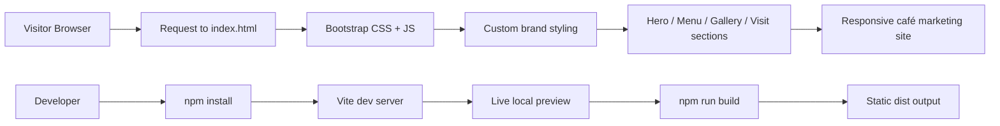
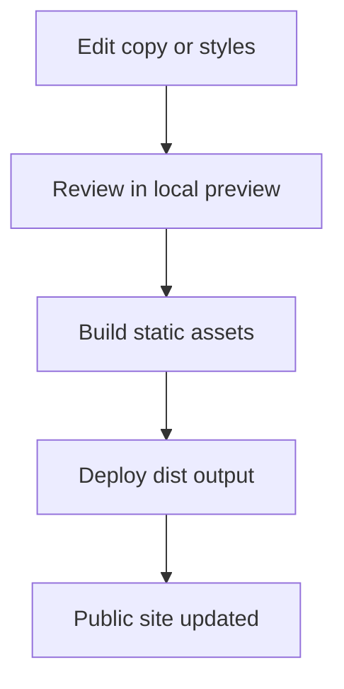

# Range Finder Coffee

A modern coffee shop landing page built with Bootstrap, Vite, and a small front-end toolchain. This project was intentionally refactored into a lightweight static experience designed for speed, maintainability, accessibility, and easy operational upkeep.

## Overview

Range Finder Coffee is not just a marketing page. It is a small business front-end pattern that balances visual warmth with operational discipline. The site is built to feel approachable and premium while remaining extremely easy to run on a simple static hosting setup.

The overall goal is simple:

- make the brand feel memorable and professional
- keep page delivery fast and dependable
- ensure the interface remains accessible to a broad audience
- avoid unnecessary complexity in the stack
- leave room for future expansion without locking the project into a heavy framework

This is a small but thoughtful front-end system, designed for a coffee shop that values local atmosphere, speed, and low operational overhead.

---

## Why this architecture

A static site is the right default for this project because most of the content is presentation-first rather than data-heavy or database-driven.

In a typical café case, the following are true:

- the homepage does not need a server-rendered application layer
- the menu is mostly curated, stable content
- hours and location details are low-frequency updates
- photos and promotional content change occasionally, not constantly
- performance matters more than a complex admin backend

This means the system can stay lean:

- HTML provides structure
- CSS provides design and responsiveness
- JavaScript adds lightweight enhancement
- Bootstrap supplies a predictable component system
- Vite supplies a clean development and build cycle

The result is a simpler product that has fewer moving parts and fewer failure points.

> [!IMPORTANT]
> A static site is not "cheap" or "simple" in a bad sense. It is a deliberate design choice. For a small brand site, it gives the best tradeoff between speed, maintenance burden, and reliability.

---

## Key goals

The system is optimized around a few practical outcomes:

1. Fast first render
2. Clean responsiveness across devices
3. Thoughtful visual branding
4. Good accessibility by default
5. Easy future modifications
6. Low operational complexity

These goals matter because a café website is often used by guests during time-sensitive moments:

- people checking hours before they visit
- customers looking up the menu before leaving home
- passersby browsing the atmosphere and offerings
- local patrons deciding whether to stop in

The site is built to serve all of those use cases without friction.

---

## Project structure

```text
.
├── index.html
├── package.json
├── src/
│   ├── main.js
│   └── styles.css
├── .gitignore
├── .env
├── LICENSE
├── README.md
├── .github/
│   └── workflows/
│       └── php-lint.yml
├── dist/
│   └── generated by Vite during production builds
└── node_modules/
    └── installed local dependencies
```

### Component responsibilities

| Path | What it does | Why it matters |
|---|---|---|
| `index.html` | Main page structure and content layout | Keeps the site easy to read and edit |
| `src/main.js` | Boots Bootstrap and initializes simple script behavior | Adds enhancement without heavy complexity |
| `src/styles.css` | Brand styling, layout overrides, design system | Gives the site its own identity |
| `package.json` | Project scripts and dependency metadata | Defines the build and dev workflow |
| `.github/workflows/php-lint.yml` | Basic CI verification | Ensures the project still builds correctly |
| `dist/` | Production output | The deployable static build |

---

## High-level architecture



### Why this diagram matters

This is a minimal architecture, but it is intentional. The site is designed to avoid unnecessary layers between the browser and the final content.

In a static site, the real decisions are about:

- structure
- content hierarchy
- performance
- styling consistency
- accessibility

The architecture is intentionally shallow, which reduces debugging time and hosting complexity.

---

## Performance model

Performance is often the most important hidden feature of a small marketing site. A design that loads in a fraction of a second feels more premium, and it also reduces drop-off.

A practical performance model for a site like this is:

```text
Total page cost ≈ asset transfer + render work + network latency
```

For a simple landing page, the goal is to keep this low:

- small CSS footprint
- a few remote image assets
- no huge client-side application framework
- minimal JavaScript
- efficient asset loading

In more concrete terms, a front-end performance target can be framed as:

```text
Target TTFB + render budget < 1 second on a normal broadband connection
```

This is not a marketing slogan. It is a realistic goal for a static landing page serving a local business.

> [!TIP]
> Static sites typically win on perceived speed because the browser has fewer runtime tasks to perform. That matters in the real world, especially for mobile visitors.

---

## Accessibility model

Accessibility is not an afterthought here. It is a core requirement for a public-facing local business site.

The interface is built with a few principles in mind:

- content order should be logical
- headings should be meaningful
- links and buttons must be clear
- contrast should remain readable
- keyboard users should be able to navigate without trap

A practical accessibility model can be summarized as:

```text
Usability = clarity + structure + contrast + keyboard support + semantic HTML
```

Why this matters:

- older patrons may prefer larger text and higher contrast
- screen reader users rely on semantic structure
- families with children may navigate on mobile devices without precise mouse control
- public-facing sites should work well for all local visitors

The layout uses Bootstrap components with custom semantic styling so that the experience is clean and understandable across devices.

---

## Security and operational thinking

Even a static site should be designed with sensible operational safeguards. The project is intentionally simple, but it still benefits from a security-aware mindset.

### Security principles used here

- limit the use of third-party script and styling dependencies
- prefer a small, known dependency set
- avoid unnecessary client-side frameworks
- keep custom code simple and readable
- run a clean build pipeline for predictable release output

A simple security posture can be expressed as:

```text
Risk exposure ≈ attack surface × dependency complexity × maintenance gaps
```

This project keeps the right side of that equation low by reducing complexity.

### Operational ideas reflected in the design

A well-run small website usually benefits from a few important habits:

- keep content easy to review
- keep deployment predictable
- maintain a small set of dependencies
- minimize moving parts
- prefer simple, explicit build scripts

The site reflects those patterns directly.

> [!NOTE]
> Small business sites often fail not because of a dramatic breach, but because of operational drift: unclear ownership, too many dependencies, and brittle deployment steps. Simplicity reduces that risk.

---

## Why Bootstrap is used here

Bootstrap is a good fit because it gives a strong, tested baseline for layout and component consistency without forcing the project into a heavy framework model.

### Bootstrap helps with:

- grid layout
- responsive spacing
- navigation patterns
- cards and panels
- buttons and callouts
- carousel support
- consistent visual rhythm

### Why not a full application framework?

The site does not need:

- component state management
- route-based navigation
- server-side rendering
- custom data fetching infrastructure
- a frontend application runtime

In other words, the job is presentation, not workflow orchestration. A full framework would add weight without adding user value.

The design decision can be summarized as:

```text
Need for app state = low
Need for brand polish = high
Need for static delivery = high
```

This makes Bootstrap a practical middle ground.

---

## Build workflow

The project is intentionally simple to build.

### Local development

```bash
npm install
npm run dev
```

This starts the Vite development server and allows the site to be previewed locally.

### Production output

```bash
npm run build
```

This creates a static production build in the `dist/` directory.

### Why this workflow works well

- local preview is quick
- the build output is deterministic
- the final artifact is easy to deploy to a CDN or static host
- there is no server-side runtime to debug during normal use

A simple build process reduces the chance of breakage during routine edits.

---

## Content and layout model

The page is intentionally organized into a clear narrative flow:

1. hero section for first impression
2. story and brand positioning
3. featured menu items
4. visual gallery
5. visit and hours information

This sequence matters because a café website works best when it answers the most common visitor questions quickly.

### Visitor intent mapping

| Visitor question | Matching section |
|---|---|
| What is this place? | Hero + About |
| What do you serve? | Menu |
| What does it feel like inside? | Gallery |
| Where are you located? | Visit section |
| When are you open? | Hours panel |

This is a classic content strategy pattern: lead with immediate value, support with details, then convert interest to action.

---

## Design system notes

The brand language is warm and grounded. The colors, typography, and spacing are chosen to imply comfort and authenticity.

### Visual cues used

- earthy browns and warm neutrals for grounding
- copper and gold accents for warmth
- serif headings for editorial appeal
- sans-serif body type for clarity and comfort
- soft card borders and gentle shadows for approachability

This helps the site feel like a neighborhood coffee destination rather than a generic corporate page.

---

## Operational maintenance model

The project is intentionally structured so that small future edits are straightforward.

### A typical maintenance flow

1. Adjust copy in `index.html`
2. Tweak style in `src/styles.css`
3. Rebuild locally with `npm run build`
4. Deploy the generated `dist/` output

This keeps the process understandable even for a small team.



### Why this is valuable

A static site is easy to reason about because the workflow is deterministic and visible. There is no database, no CMS session layer, no complicated admin permissions, and no runtime backlog to troubleshoot.

---

## Future extension paths

This project is intentionally easy to grow without becoming bloated.

Possible extensions could include:

- additional menu categories
- event-specific landing blocks
- testimonials or community quotes
- newsletter signup section
- order or reservation CTA
- social media feed embedding
- staff or story-driven pages

These additions would still fit the same static pattern without forcing a larger framework or server-side application stack.

> [!TIP]
> The easiest way to expand a static site is to keep the content model obvious. If the page can be understood in one pass, it is much easier to extend safely.

---

## Why this project works well for a small business

This project is a practical example of a good front-end choice for a local brand:

- low operational friction
- strong visual identity
- excellent performance characteristics
- clear maintenance workflow
- easy hosting model
- accessible user experience

A site like this does not need to be a complex system to be effective. It needs to be clear, reliable, and pleasant to use.

That is the core idea behind the design.

---

## Quick start summary

```bash
npm install
npm run dev
```

Then open the local preview URL shown by Vite.

For production output:

```bash
npm run build
```

The result is a deployable static build in the `dist/` folder.

---

## License

This project is licensed under the MIT License. See [LICENSE](LICENSE) for details.

---

## Additional notes

### Using GitHub markdown effectively

This README uses a few GitHub-friendly features to make the documentation easier to scan:

- tables for structured comparisons
- fenced code blocks for commands and output
- Mermaid diagrams for architecture flows
- blockquotes for emphasis and guidance
- callouts like `NOTE`, `TIP`, and `IMPORTANT`
- collapsible sections using `<details>`

These patterns improve readability without adding visual noise.

> [!NOTE]
> Good documentation is part of the product. A site may be beautiful, but if the project is hard to understand or maintain, the long-term value drops quickly.

---

## Final summary

Range Finder Coffee is a static, Bootstrap-powered site intentionally designed for clarity, performance, and low operational overhead. It balances warmth and professionalism with an architecture that is easy to maintain and easy to explain.

The project is intentionally simple because complexity is not the goal. The goal is a reliable front-end experience that makes the café feel welcoming while keeping the build system lean and effective.
