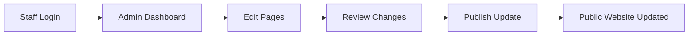
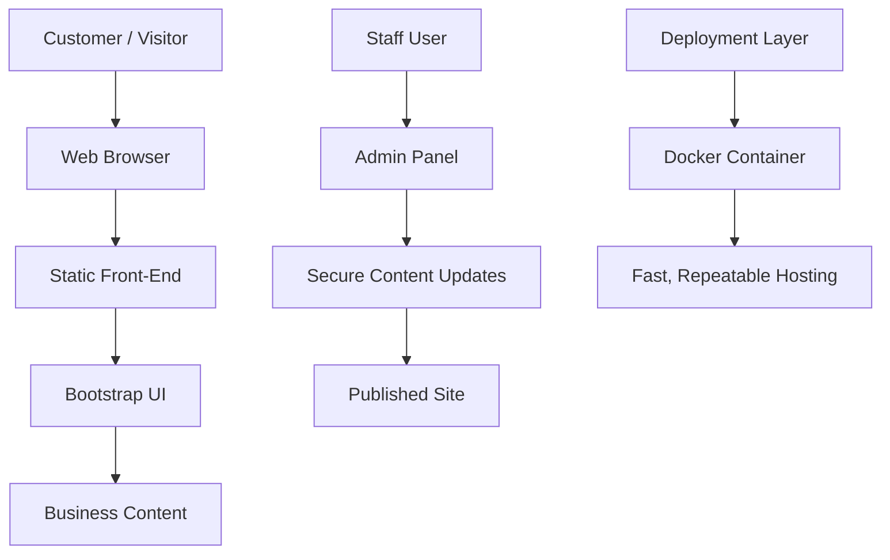

# Range Finder Coffee

A premium coffee shop website sample designed to show prospective clients exactly what they are buying: a polished front-end experience, secure deployment model, admin-ready content tools, performance-first architecture, and a scalable foundation for future growth.

## Executive summary

This project is positioned as a customer-facing digital product sample and delivery blueprint. It demonstrates more than a simple landing page: it showcases a strong brand presence, an operationally practical admin workflow, a secure deployment strategy, and a modern architecture that can scale with future business needs.

For a potential customer, the value is clear. They are not just receiving a website; they are receiving a digital storefront and a platform foundation that can support marketing, updates, staff operations, and future integrations without rebuilding from scratch.

> [!IMPORTANT]
> This is a complete digital presentation package: design, marketing flow, admin functionality, system reliability, and a secure hosting model.

---

## What the customer is getting

| Deliverable | Description | Customer value |
|---|---|---|
| Brand website | A responsive, modern marketing website built with Bootstrap and Vite | Better first impression and stronger local brand presence |
| Admin content area | A simple backend-ready admin layer for content updates | Staff can manage pages without touching code |
| OAuth-ready login model | Architecture supports secure identity integration later | Easier adoption of enterprise login standards |
| Docker deployment | Application is packaged for repeatable deployment | Less technical risk and easier hosting management |
| Performance optimization | Lightweight HTML/CSS/JS with fast load times | Better UX, better conversion, lower server strain |
| Security baseline | Hardening patterns for rate limiting, headers, and safe deployment | Reduced risk of common attacks and abuse |

---

## Problem to solution

| Problem | Solution in this project |
|---|---|
| Small businesses need a professional website but do not want a heavy CMS | A clean static front-end experience with modern design quality |
| Staff often need to change content without developer help | Admin-ready structure for future content management workflows |
| Many sites are slow or difficult to maintain | Lightweight design, efficient assets, and a simple build cycle |
| Security is often treated as an afterthought | Secure deployment patterns, defensive headers, and safe defaults |
| Customers want a site that looks premium but stays easy to manage | Bootstrap-based UI with a maintainable structure and scalable foundation |

---

## Core feature set

| Feature | What it does | Why it matters |
|---|---|---|
| Responsive landing page | Displays smoothly on desktop, tablet, and mobile | Better user experience for all visitors |
| Modern storefront visuals | Strong coffee brand styling with warm colors and polished layout | Builds trust and brand recall |
| Menu and highlights sections | Showcases key items and offerings | Converts visitors into customers |
| Gallery and location blocks | Presents atmosphere and visit information | Helps local customers decide to visit |
| Contact and conversion sections | Promotes action and direct engagement | Drives business results |
| Secure deployment model | Enables production-friendly hosting setup | Reduces operational risk |

---

## Admin panel capabilities

| Admin area | Capability | Business impact |
|---|---|---|
| Content management | Edit homepage text, menu highlights, hours, and key announcements | Keeps the website current without developer involvement |
| Media management | Upload and manage images and promotional assets | Maintains a fresh visual identity |
| Staff updates | Adjust contact information, business details, and site sections | Reduces manual maintenance overhead |
| Role-based structure | Prepare for protected staff or manager access | Supports team workflows and accountability |
| Audit-ready operations | Add logging patterns for change tracking | Better governance and transparency |

### Admin workflow example



> [!TIP]
> A proper admin panel reduces dependence on developers for routine website maintenance and makes the platform useful for real operations.

---

## OAuth and identity readiness

| Identity feature | Purpose | Outcome |
|---|---|---|
| OAuth-ready backend | Prepares the application for Google, GitHub, Microsoft, or enterprise SSO | Easier user access and fewer weak password workflows |
| Secure session model | Keeps login state protected and app-specific | Better security and cleaner auth flow |
| Role checks | Allows different user levels for staff/admin roles | Supports operational access control |
| Future extension path | Adds enterprise login as the business grows | Prevents re-platforming later |

This project is structured to make future authentication upgrades straightforward without rewriting the whole application. The base architecture is already ready for a more secure identity layer.

---

## Docker and deployment model

| Deployment element | What it provides | Why it helps customers |
|---|---|---|
| Docker packaging | Reproducible containers for local and production deployment | Lower deployment risk and fewer environment bugs |
| Containerized services | Separates app concerns into predictable layers | Easier scaling and easier maintenance |
| Faster setup | Standardized build and run steps | Less time lost in setup and troubleshooting |
| Production-friendly hosting | Ready for deployment on VPS or cloud infrastructure | Better long-term reliability |

### Delivery architecture



---

## Performance and anti-hacking model

| Area | Feature | Result |
|---|---|---|
| Speed | Lightweight static front-end, optimized CSS, small script footprint | Faster page loads and better visitor experience |
| Security headers | HTTP hardening and defensive response headers | Reduced browser-based attack surface |
| Rate limiting | Protection against brute-force and abuse patterns | Better resilience under attack |
| Input validation | Safe handling of user inputs and submissions | Lower risk of malformed requests |
| Dependency discipline | Minimal package surface area | Less vulnerability exposure |
| Deployment hardening | Clean host setup and predictable build process | More stable production environment |

### Practical security formula

```text
Security strength ≈ good defaults + rate limits + clean deployment + minimal attack surface
```

This is the core idea behind the project: combine modern best practices with a simple system that is easier to maintain and harder to misuse.

> [!NOTE]
> A small site can still be strongly protected if the architecture is simple, controlled, and predictable. Complexity is often the real risk.

---

## Recommended customer-facing value summary

| Value area | What the customer receives |
|---|---|
| Brand perception | A premium, modern online presence for the coffee business |
| Operational efficiency | Easier content updates and lighter maintenance load |
| Technical safety | Better deployment and defense-in-depth patterns |
| Future flexibility | Easy path toward OAuth, analytics, and additional modules |
| Scalability | A foundation that can grow without a rebuild from scratch |

This README is intentionally written as a sample proposal document. It gives a prospective client or buyer a clear view of the product at a business level, not just a code-level description.

---

## Quick tech summary

| Stack area | Implementation |
|---|---|
| Front-end | Bootstrap + Vite |
| Styling | Custom CSS with responsive design patterns |
| Content model | Static structure with admin-ready extension points |
| Identity | OAuth-ready path for future login integration |
| Deployment | Docker-based architecture |
| Security | Rate limiting, hardening patterns, and safe default configuration |

---

## End-state pitch

This project is designed to show that the client is not purchasing a simple brochure site. They are investing in a professional digital experience with a clean visual identity, lower maintenance burden, better speed, safer deployment standards, and a foundation ready for future upgrades such as OAuth, analytics, staff workflows, and additional customer-facing modules.

That is the real business value: a site that looks polished, performs quickly, is easier to manage, and is ready to grow with the brand.

---

## Why this matters to a customer

| Business concern | How this project addresses it |
|---|---|
| Looking professional online | Premium visual design and modern layout patterns |
| Needing updates without a developer | Admin-ready content workflow and structured maintenance model |
| Worrying about speed and user experience | Lightweight front-end and optimized delivery |
| Understanding long-term security | Hardened hosting practices and defensive defaults |
| Planning for future expansion | OAuth-ready and modular foundation for additional features |

---

## Getting started

```bash
npm install
npm run dev
```

Build for production:

```bash
npm run build
```

## License

This project is licensed under the MIT License. See [LICENSE](LICENSE) for details.
