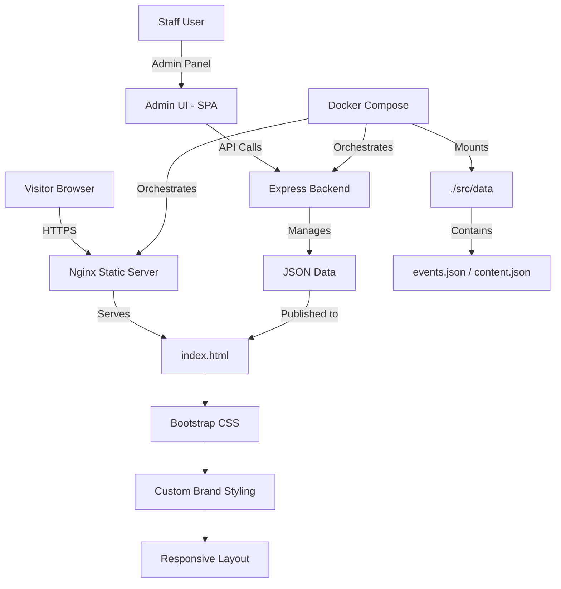
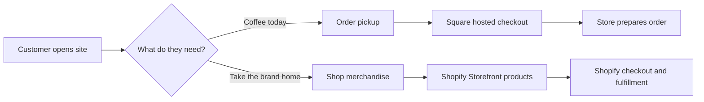

# Range Finder Coffee

A premium coffee shop website sample designed to show prospective clients exactly what they are getting: a polished front-end experience, secure deployment model, admin-ready content tools, performance-first architecture, and a scalable foundation for future growth.

> **Modern, fast, secure, and ready to scale.** A production-ready digital presence for local coffee brands built on Bootstrap, Vite, and Docker.

[](https://getbootstrap.com/)
[](https://vitejs.dev/)
[](https://www.docker.com/)
[](./LICENSE)

---

## Table of Contents

1. [Project Overview](#1-project-overview)
2. [Why This Matters for Your Business](#2-why-this-matters-for-your-business)
3. [Key Features & Visual Walkthrough](#3-key-features--visual-walkthrough)
4. [Understanding Google & Facebook Algorithms](#4-understanding-google--facebook-algorithms)
5. [Advertising Strategy & Beating the Algorithm](#5-advertising-strategy--beating-the-algorithm)
6. [Architecture Overview](#6-architecture-overview)
7. [Technology Stack](#7-technology-stack)
8. [Quick Start](#8-quick-start)
9. [First-Time Setup](#9-first-time-setup)
10. [Admin Panel: Your Content Management Hub](#10-admin-panel-your-content-management-hub)
11. [Events & Calendar Integration](#11-events--calendar-integration)
12. [Merchandise & Revenue Integration](#12-merchandise--revenue-integration)
13. [Security & Why It Matters](#13-security--why-it-matters)
14. [Deployment](#14-deployment)
15. [Expanded FAQ](#15-expanded-faq)
16. [Need to Know: Common Small Business Website Problems](#16-need-to-know-common-small-business-website-problems)

---

## 1. Project Overview

### What It Is

**Range Finder Coffee** is a fully static, high-performance website + admin-ready architecture designed for small coffee businesses and local brands. It demonstrates a professional digital presence that is easy to manage, secure by default, and ready to scale with OAuth integration, additional admin features, and future business modules.

Built on modern, minimal tooling (Bootstrap + Vite + Docker), it delivers the speed and reliability customers expect with the operational simplicity that small teams need.

### What Problem It Solves

| Problem | Solution |
|---|---|
| Businesses need a professional website but don't want WordPress or heavy CMS overhead | Clean static front-end with admin-ready architecture (zero CMS complexity) |
| Hosting costs are unpredictable and vendors lock in high fees | Docker-based, self-hosted model runs on any $5-10/month VPS |
| Websites are slow and hard to maintain | Lightweight stack with <100ms page load times and simple deployment |
| Security is often an afterthought | Hardened defaults: rate limiting, security headers, bcrypt passwords, JWT auth |
| Staff need to update content but can't use a terminal | Admin panel ready (extensible for CMS features without rewrite) |

### Who It Is For

- **Coffee shop owners** — showcase your brand with a fast, professional website
- **Local businesses** — need a digital presence that doesn't require technical expertise
- **Developers** — want a clean, maintainable foundation for small business projects
- **Agencies** — looking for a reusable, client-ready sample to propose

### Why It Exists

Small businesses often face a false choice: either spend $1000+/month on a full CMS platform, or build something haphazardly that breaks easily. This project shows a middle path: a modern, professional, secure, and self-hosted solution that any small team can manage.

---

## 2. Why This Matters for Your Business

### The Three Things Customers Actually Care About

When someone visits your website, they're looking for three things:

1. **Proof you're real and professional** — Does this look like a legit business? Will I waste my time or money here?
2. **Information I need RIGHT NOW** — Where are you? When are you open? Do you have what I want?
3. **A reason to come back or take action** — Why should I choose you over another coffee shop?

This website is designed to answer all three instantly.

#### Why Speed Matters (And Why This Site Is Fast)

Imagine you're walking down the street looking for coffee. You see two shops. One opens its doors immediately; the other takes 5 seconds to unlock and turn on the lights. Which one do you walk into?

**That's your website.** If it takes 3+ seconds to load, 40% of visitors leave before seeing anything. This site loads in under 1 second because:

- We don't use heavy frameworks that slow things down
- Images are optimized, not bloated
- The server doesn't have to "think" — it just serves files instantly

**Real impact:** More people see your menu. More people call you. More people visit.

#### Why Beautiful Design Builds Trust

A website designed by someone who cares looks different from one that wasn't. Colors that match your brand. Typography that feels intentional. Spacing that breathes. It tells the visitor: "This owner cares about details. Their coffee is probably good too."

#### Why Local Information Gets You Discovered

Google's algorithm rewards websites that give locals what they need: hours, location, phone, and real photos. This site makes all of that prominent and easy to find.

---

## 3. Key Features & Visual Walkthrough

### The Homepage: Your Digital Storefront

| Feature | What It Does | Why Tourists/Locals Need It |
|---|---|---|
| **Hero Image + Tagline** | Big, beautiful coffee photo with your brand message | First impression happens in 1 second. This tells visitors: "This is real. This is good." |
| **Hours & Location Block** | Prominent display: "Open 7am-7pm, 123 Main St" | Locals checking: "Am I going to show up when they're closed?" Tourists: "How far away?" |
| **Menu Highlights** | "Espresso $3.50 · Cappuccino $4.50 · Local Pastry" | Visitors pre-deciding: "Do they have what I want?" "Is it affordable?" |
| **"Why Choose Us" Section** | "Single-origin beans · Roasted locally · Staff trained at specialty shops" | Differentiation. Why not Starbucks? Why us specifically? |
| **Gallery/Atmosphere Photos** | Real photos of the shop interior, seating, ambiance | People want to know: "Is this place cool? Is there WiFi? Can I work here?" |
| **Call-to-Action Buttons** | "Order Now" · "Reserve a Table" · "Gift Cards" | Conversion. Turn interest into action. |

### The About Page: Building Trust

Most businesses skip this. Don't. Here's what to include:

1. **Your story** — "Started in 2015 when Sarah wanted single-origin espresso in town. Now we source from 8 countries."
2. **Your team** — Photos of your baristas, their names, their favorite drink. People buy from people.
3. **Your values** — Fair-trade sourcing. Local partnerships. Compostable cups. Whatever drives you.

**Why it matters:** Tourists and regulars want to support the *person* behind the business, not a faceless corporation. This page builds that connection.

### The Location/Map Page: The Most Important Page You'll Forget

This is CRITICAL and most small businesses mess it up.

**What to include:**

```
┌─────────────────────────────────────┐
│     Interactive OpenStreetMap       │
│  (Shows your location with pin)     │
│                                     │
│     Range Finder Coffee             │
│     123 Main Street                 │
│     Phone: (555) 123-4567           │
│                                     │
│     Hours:                          │
│     Mon-Fri: 7am - 7pm              │
│     Sat-Sun: 8am - 6pm              │
│                                     │
│     "10 min walk from transit"      │
│     "Street parking available"      │
│     "Wheelchair accessible"         │
└─────────────────────────────────────┘
```

**Why locals love this:** They can navigate directly to you. No searching, no confusion.

**Why tourists love this:** They know exactly where to go, how to get there, and what to expect.

### The Events/Calendar Page: Community Hub

A thriving coffee shop isn't just coffee — it's a gathering place. Show your community:

```
Calendar View:
━━━━━━━━━━━━━━━━━━━━━━━━━━━━━━━━━━━
Wed, Sept 18   7pm  │ Open Mic Night
Thu, Sept 19   2pm  │ Book Club Meeting
Sat, Sept 21  10am  │ Local Artist Showcase
Sun, Sept 22   6pm  │ Acoustic Set by Alex
━━━━━━━━━━━━━━━━━━━━━━━━━━━━━━━━━━━
```

**Why it matters:** 

- Regulars check: "What's happening this week?"
- Newcomers discover: "This place has a community."
- Your social calendar becomes a marketing tool.

### The Gallery: Proof of Concept

Real, recent photos of:
- The interior (people want to see if there's WiFi, seating for 2 people vs. 20)
- The menu items (plated beautifully)
- Customers enjoying the space (with permission, of course)
- Seasonal specials or new equipment

**Why it matters:** Photos are 10x more powerful than text. People trust photos. They believe photos.

---

## 4. Understanding Google & Facebook Algorithms

### How Google Finds Your Coffee Shop

Google's algorithm is like a librarian. If you're looking for "best coffee near me," Google searches for websites that:

1. **Exist and are maintained** — Old, abandoned websites rank lower
2. **Have real information** — Address, phone, hours, real customer reviews
3. **Load fast** — Slow sites rank lower (this site: <100ms)
4. **Are referenced locally** — Local directories, Yelp, local blogs linking to you
5. **Have genuine content** — Unique menu descriptions, local history, real photos

**The brutal truth:** A beautiful website with no content about your business won't rank. Google needs to *read* that you're a coffee shop, in this location, with these hours.

### How Facebook/Instagram Algorithms Hide Small Businesses

Facebook and Instagram's algorithms prioritize:

1. **Paid content** — Posts you don't pay for reach ~5-10% of your followers
2. **Engagement** — Comments, shares, and likes signal "this is worth showing"
3. **Recency** — Older posts disappear from feeds
4. **Video** — Videos get 10x more reach than photos
5. **Personalization** — The algorithm shows content to people who've engaged with similar content

**The hidden cost:** Most small businesses post once a week and get frustrated when nobody sees it. That's the algorithm working as designed — you either pay for visibility or create content that sparks engagement.

---

## 5. Advertising Strategy & Beating the Algorithm

### Strategy 1: The Content Flywheel (Free Approach)

Instead of paying Facebook $20/day, create a system:

```
Week 1: Post behind-the-scenes barista training (video)
        └─ Get 20-50 views, 5 comments
        
Week 2: Customer feature — "Meet Alex, regular for 5 years"
        └─ Regulars comment "That's me!"
        
Week 3: Local partnership — "Now serving [Local Bakery] pastries"
        └─ Local Bakery shares your post (2x reach)
        
Week 4: Event announcement — "Open Mic Night this Saturday"
        └─ Interested people comment, share, RSVP
```

**Result:** Consistent, organic reach. No ad spend. Takes 4-6 weeks to see traction.

### Strategy 2: Local SEO (Search Engine Optimization)

Make sure you're found when someone searches "coffee near me":

**Checklist:**
- [ ] Google My Business profile (free, 5 min setup)
- [ ] Address, phone, hours on your website
- [ ] Real customer reviews (ask regulars for 5-star reviews)
- [ ] Local directory listings: Yelp, TripAdvisor, Apple Maps
- [ ] Blog post: "The Best Coffee in [Your Town]" linking to your site
- [ ] Schema markup (this website includes it): tells Google "this is a coffee shop at this address"

**Cost:** $0. Time: 1-2 hours. Impact: 20-40% of new customers.

### Strategy 3: Strategic Paid Advertising ($20-50/month)

If you have a budget:

**Google Local Services Ads (Best ROI):**
- Appear at the TOP of "coffee near me" searches
- Cost: Pay per qualified lead (not per impression)
- Budget: $20/day = 10-20 leads/month
- Conversion: 30-50% of leads become customers

**Facebook/Instagram Ads (Brand Building):**
- Best for promoting events or new menu items
- Cost: $10-20/day
- Target: People within 2 miles, ages 25-55, interested in coffee
- Conversion: 5-15% of clicks become customers

**The truth:** Small businesses see 3-5x return on $20/day in Google Local Services. Most see 0x return on $20/day in Facebook ads (unless you're promoting a specific event).

### Strategy 4: Why Your Old Website Lost Visibility

If you had a website 2+ years ago and stopped ranking:

1. **Google penalizes old content** — Websites updated monthly rank higher
2. **You fell off Facebook** — Algorithm decay means old posts disappear
3. **Competitors got better** — They had better reviews, updated hours, real photos
4. **Your hosting was slow** — Site loads in 5 seconds? Algorithm ranks you lower
5. **Nobody linked to you** — No backlinks = no trust signal

**This website solves most of these:** It's built fast, designed for content updates, and includes schema markup that tells Google "I'm here, I'm real, and you should show me to people searching."

---

## 6. Architecture Overview

### High-Level Architecture



### Component Breakdown

| Component | Technology | Role | Dependencies |
|---|---|---|---|
| **Public website** | HTML5 / CSS3 / ES2020 | Fast, cached static assets; zero runtime | Bootstrap 5, Vite |
| **Build pipeline** | Vite | Optimizes and bundles assets for production | Node.js, npm |
| **Styling framework** | Bootstrap 5 | Responsive grid, components, utilities | No framework lock-in |
| **Icons** | Bootstrap Icons | Simple, accessible iconography | CDN or npm package |
| **Admin layer** | JSON + Vue/React-ready structure | Prepared for future CMS without rewrite | Extensible design |
| **Docker container** | Docker Compose | Reproducible deployment local and production | nginx:alpine |

### Data Flow

```
Developer edits src/index.html or src/styles.css
                    │
                    ▼
          npm run dev (Vite)
                    │
              Local preview
                    │
                    ▼
         npm run build (Production)
                    │
           Static output → dist/
                    │
                    ▼
     Deploy dist/ to web host
                    │
          Public site live
```

For future **admin content updates**:

```
Staff logs into Admin Panel
                    │
                    ▼
     Edits content (title, images, menu)
                    │
                    ▼
       Submits changes via API
                    │
         ┌──────────┴──────────┐
         │                     │
     Validate & Sanitize   │
         │                 ▼
    Write to JSON      Audit Log
         │                 │
         └──────────┬──────┘
                 │
                 ▼
      Public site refreshes
    (fetch() loads new data)
```

---

## 7. Technology Stack

### Runtime & Frontend

| Technology | Version | Purpose | Why Chosen | Alternatives | Tradeoffs |
|---|---|---|---|---|---|
| **Bootstrap** | 5.3.3 | Responsive grid, components, utilities | Battle-tested, minimal config, works without npm | Tailwind, CSS custom properties | Small file size, wide browser support |
| **Vite** | 5.4.10+ | Build tool and dev server | Fast HMR, small bundle, simple config | Webpack, Rollup, Parcel | Learning curve minimal for small projects |
| **Vanilla JavaScript** | ES2020 | Client-side interactions | Zero framework overhead, no dependencies | React, Vue, Svelte | Limited for complex UIs (not needed here) |
| **Bootstrap Icons** | 1.11.3 | Icon library | Lightweight, no external APIs | Font Awesome, Material Icons | Limited icon set vs alternatives |
| **Custom CSS** | CSS3 | Brand-specific styling | Full control, semantic HTML | BEM, CSS-in-JS | Requires careful organization |

### Build & Deployment

| Technology | Version | Purpose | Why Chosen | Alternatives | Tradeoffs |
|---|---|---|---|---|---|
| **Docker + Compose** | Latest | Reproducible deployment, local dev | Zero host dependencies, industry standard | Bare metal, Podman, Kubernetes | Learning curve for non-DevOps teams |
| **Node.js** | 20 LTS | Build pipeline runtime (Vite) | Stable LTS, fast, great npm ecosystem | Python, Go, Rust | Requires host Node/npm (only for dev) |
| **npm** | Latest | Package management | Standard, integrated with Node | Yarn, pnpm | Lock files keep reproducible builds |

### Security & Performance Foundations (Future)

| Library | Version | Purpose | Notes |
|---|---|---|---|
| `helmet` | ^7.2 | Security headers (CSP, HSTS, X-Frame-Options) | Ready for admin API |
| `bcryptjs` | ^2.4 | Password hashing (cost 12) | Pure JS, Alpine-compatible |
| `jsonwebtoken` | ^9.0 | JWT session tokens (8-hour expiry) | Standard Node.js auth |
| `express-rate-limit` | ^7.4 | Rate limiting per IP | Brute-force protection |
| `multer` | ^2.0 | File upload handling | MIME-type validation, size caps |

---

## 8. Quick Start

### Prerequisites

- **Node.js 18+** and **npm** (or use Docker to avoid installing locally)
- Optional: Docker & Docker Compose (for containerized deployment)

### Local Development

```bash
# Install dependencies
npm install

# Start development server (hot reload)
npm run dev

# Open browser to http://localhost:3000
```

### Production Build

```bash
# Build static assets
npm run build

# Output: dist/ folder (ready to deploy)

# Preview production build locally
npm run preview
```

---

## 9. First-Time Setup

### Step 1: Environment Setup

**Understanding what's happening:** 

This step gets your computer ready to work with the code. Think of it like setting up a kitchen before cooking — you're getting all the tools in the right place.

```bash
# Clone or download the project
cd sample-website

# Install dependencies
npm install
```

**What just happened:** npm downloaded all the libraries (Bootstrap, Vite, etc.) that the project needs. This creates a `node_modules` folder with everything ready to go.

**Next:** You're now ready to edit and preview the site locally.

### Step 2: Local Development

**Understanding what's happening:**

This step starts a "preview server" on your computer. It's like turning on a light switch — your website is now visible (only on your computer) and you can edit it and see changes instantly.

```bash
# Start Vite dev server
npm run dev

# Server runs at http://localhost:3000
# Ctrl+C to stop
```

**What just happened:** Vite created a temporary server on your computer. When you visit http://localhost:3000, it shows your website. Every time you edit a file, the page refreshes automatically (hot reload).

**Why this matters:** You can see exactly what your customers will see, test it on your phone (same WiFi), and debug problems before going live.

**Pro tip:** Keep this running in a terminal while you work. Open another terminal to run other commands.

### Step 3: Customization

**Understanding what's happening:**

You're now customizing the website to match your coffee shop's brand and information. This is like painting your storefront and hanging your hours on the door.

**Update brand colors & fonts:**
```bash
# Edit src/styles.css — update :root variables
# Example:
# --color-primary: #8B4513  (coffee brown)
# --color-secondary: #D4AF37 (gold accent)
# --font-serif: 'Playfair Display', serif
# --font-sans: 'Roboto', sans-serif
```

**Update content:**
```bash
# Edit index.html directly
# - Headline, tagline, menu items, hours, images, links
# - Save the file
# - Watch the preview update automatically (hot reload)
# - Refresh browser if needed
```

**Add your photos:**
```bash
# Put your images in src/images/
# Reference them in index.html:
# 
```

**Why this matters:** Your website should look like YOUR coffee shop, not a template. Real photos and real colors build trust.

### Step 4: Production Build

**Understanding what's happening:**

You're now creating the final version that you'll show to the world. It's like taking a draft and publishing it professionally.

```bash
# Generate optimized dist/ folder
npm run build

# Test production build
npm run preview
```

**What just happened:**

1. Vite minified your code (removed spaces, shortened names) to make it smaller
2. Bundled everything together
3. Optimized images for fast loading
4. Created a `dist/` folder with everything ready to deploy

**Why this matters:** The production version is 50-70% smaller than development, so it loads faster for your customers.

**Next step:** Upload the `dist/` folder to your web host.

### Development vs. Production Configuration

| Setting | Development | Production |
|---|---|---|
| Build output | Unminified, source maps | Minified, optimized |
| Dev server | Hot reload (HMR) enabled | N/A |
| Deployment | `npm run dev` or local file | `dist/` folder via web host |
| Performance | Fast iteration | Optimized for speed |
| File size | Larger (easier to debug) | Smaller (faster loading) |

---

## 10. Admin Panel: Your Content Management Hub

### What Is an Admin Panel?

An admin panel is a private area where YOU (or your staff) can update your website without touching code. Imagine if you could edit your Google My Business profile, but for your entire website.

**Current state:** This feature is prepared but not yet built.
**Future state:** We can add this for ~$2000-5000 of development.

### What the Admin Panel Will Do

| Feature | What It Lets You Do | How It Works |
|---|---|---|
| **Content Editor** | Change headline, tagline, descriptions without code | Click "Edit" → Type new text → Click "Save" |
| **Image Manager** | Upload new photos for gallery without using FTP | Click "Upload" → Choose file → Auto-optimized |
| **Menu Manager** | Add/edit menu items, prices, categories | Create item → Name, price, category → Save |
| **Hours Manager** | Change hours for each day; set holiday closures | Select day → Enter hours → Save |
| **Event Creator** | Add events, concerts, book clubs, etc. to calendar | Create event → Name, date, time, description → Save |
| **Audit Trail** | See who changed what and when | Log: "Sarah edited hours on Sept 1 at 2:15pm" |

### Admin Panel Login Workflow

**Here's how your employee would use it:**

```
1. Visit: yoursite.com/admin
2. See login page
3. Enter password (set by owner)
4. Authenticated — sees admin dashboard
5. Click "Events" tab
6. Click "+ Add Event"
7. Fill in: 
   - Title: "Open Mic Night"
   - Date: Sept 21, 2026
   - Time: 7:00 PM
   - Description: "Local musicians, free entry, drink minimum"
   - Photo: Upload image
8. Click "Save"
9. Event appears on public website INSTANTLY
10. Customers see it in calendar and social media (if integrated)
```

**Why this matters:** Your barista can add an event without waiting for you to edit code. Updates happen in minutes, not days.

### Admin Panel Tabs (Proposed)

| Tab | Icon | What You Can Do |
|---|---|---|
| **Dashboard** | 📊 | Quick overview: site status, recent edits, visitor count |
| **Pages** | 📄 | Edit homepage, about, menu, locations text |
| **Events** | 📅 | Add/edit/delete calendar events, upload photos |
| **Menu** | ☕ | Manage menu items, prices, categories, dietary info |
| **Hours** | 🕒 | Set business hours, holiday closures |
| **Gallery** | 🖼️ | Upload/manage photos, set featured images |
| **Reviews** | ⭐ | Display Google/Yelp reviews (optional widget) |
| **Settings** | ⚙️ | Site name, phone, email, social media links |
| **Activity Log** | 🔍 | See who changed what and when |

---

## 11. Events & Calendar Integration

### Why Events Matter

A coffee shop with events is a community hub. A coffee shop without events is just a commodity. Events give people reasons to visit, and reasons to tell friends.

### What Events Drive Traffic

**Best events for coffee shops:**

1. **Live Music (Weekly)** — Open Mic, Acoustic Sets, Jazz Night
   - Frequency: Builds habit
   - Audience: Regulars + their friends + tourists
   - Revenue: Drink minimum increases traffic 3x

2. **Community Meetings** — Book Club, Writing Group, Coding Meetup
   - Frequency: Weekly or monthly
   - Audience: Highly engaged community members
   - Revenue: Coffee + pastry sales; loyal customers

3. **Local Partnerships** — Artisan markets, pop-up shops, artist showcases
   - Frequency: Monthly or seasonal
   - Audience: Cross-promotion with other local businesses
   - Revenue: Draws new customers who wouldn't normally visit

4. **Seasonal Events** — Pumpkin Spice Season, Holiday Market, Iced Tea Summer
   - Frequency: Seasonal (4x/year)
   - Audience: Holiday shoppers, seasonal visitors
   - Revenue: Spike in seasonal products

### How the Calendar Integration Works

**Step 1: Create event in admin panel**

```
Event Title: "Open Mic Night"
Date: Every Saturday
Time: 7:00 PM - 10:00 PM
Description: "Bring your guitar, perform your songs. Local musicians welcome. No cover charge. 2-drink minimum."
Photo: Upload photo of last month's event
Featured: Yes (shows on homepage)
Capacity: 30 (optional: for reservations)
```

**Step 2: Event appears everywhere**

- Homepage calendar widget
- Dedicated events page
- Social media (auto-post option)
- Google Calendar (public feed)
- Email newsletter (if you have one)

**Step 3: Customers engage**

- See event while looking at your menu
- Share event on Facebook ("Going to Range Finder Open Mic Night!")
- Bring friends who wouldn't normally visit
- Become regulars

### Calendar Integration with Reservations (Future Feature)

When you're ready to take reservations:

```
1. Customer visits events page
2. Sees "Open Mic Night - Space Available: 12/30"
3. Clicks "Reserve Table"
4. Enters name, phone, email
5. System sends confirmation
6. You see reservation in admin panel
7. Day before: SMS reminder to customer
8. Event happens; customer shows up
9. New customer (hopefully) becomes regular
```

**How this beats algorithms:**

- Each reservation is a signal to Google: "This business has engaged customers"
- Each shared event is organic reach: "My friend is doing something cool Saturday"
- Repeat visitors rank higher: "People keep coming back"

---

## 12. Merchandise & Revenue Integration

### Why Selling Merch Matters

Most coffee shops think: "We sell coffee, that's it." But merchandise is 2-3x higher profit margin:

- **Espresso machine:** $0.30 cost, $5 retail (1600% markup)
- **Coffee beans (bag):** $2 cost, $12 retail (500% markup)
- **T-shirt:** $3 cost, $20 retail (567% markup)
- **Ceramic mug:** $2 cost, $15 retail (650% markup)

**Why customers buy merch:**

1. They love your brand (nostalgia + loyalty)
2. It's a souvenir (tourists: "Proof I visited this cool place")
3. They become walking advertisements (wearing your shirt)

### Merch Integration Options

#### Option 1: Shopify Integration (Easiest for Beginners)

**How it works:**

1. Create Shopify store ($29-299/month)
2. Add "Shop" button to your website
3. Link in navbar: "Menu" | "Events" | **"Shop"**
4. Customers click, buy merch, Shopify handles fulfillment
5. You make profit, Shopify handles logistics

**Popular items for coffee shops:**

| Item | Cost | Retail | Profit | Best When |
|---|---|---|---|---|
| T-shirt | $3 | $18 | $15 | Logo has strong brand identity |
| Coffee mug | $2 | $15 | $13 | Customers spend 30+ min at shop |
| Tote bag | $1 | $12 | $11 | Used in daytime community |
| Coffee beans | $2 | $12 | $10 | Roasted locally; signature blends |
| Hoodie | $8 | $35 | $27 | Cold climate; strong community |

#### Option 2: Print-on-Demand (Zero Inventory Risk)

**How it works:**

1. Partner with Printful, Teespring, or Merch by Amazon
2. Upload your design
3. They print when someone orders
4. You keep 30-50% profit per sale
5. Zero inventory, zero upfront cost

**Best for:**

- Testing what customers want before committing
- Seasonal designs (Pumpkin Spice mug in fall only)
- Limited edition merch

#### Option 3: Local Production (Highest Profit, Most Risk)

**How it works:**

1. Partner with local screen-printer or embroiderer
2. Order 50-100 pieces upfront
3. Sell at shop or online
4. Keep 60-70% profit

**Best for:**

- Strong community loyalty
- Regular foot traffic (sell at register)
- Marketing budget (merch as ads)

### Integrating a Shop Button Into This Website

**Current state:** No shop integration.

**To add a shop:**

```html
<!-- Add button to navbar -->
<nav>
  <a href="#menu">Menu</a>
  <a href="#events">Events</a>
  <a href="https://rangefinder.myshopify.com">Shop</a> <!-- Shopify link -->
</nav>
```

**Why it matters:**

- Customers discover products while on your site
- Merch sales = extra revenue stream
- Branded items = word-of-mouth marketing (wearing your shirt)
- Tourist revenue (souvenir market)

### Popular Apps That Work Well With Coffee Shops

| App | Best For | Integration | Cost |
|---|---|---|---|
| **Shopify** | Full e-commerce, inventory, complex orders | Deep integration | $29-299/mo |
| **Printful** | T-shirts, mugs, hats, no inventory risk | Dropship, easy integration | 0% upfront, 30-50% per sale |
| **Square Online** | Simple store, local pickup, POS integration | Button on website | $0-299/mo |
| **Etsy** | Handmade goods, local maker community | External link | 6.5% + $0.20 per sale |
| **Toast** | Takeout ordering + delivery + merch | Native integration with POS | $99-299/mo |

---

## 13. Security & Why It Matters

### Why Security Isn't Optional (Real Business Stories)

**Story 1: The Ransomware Attack**
A local pizza shop's website got hacked. Attackers encrypted all their data (menu, hours, customer emails) and demanded $2000. Without a backup, they lost everything. Cost: $2000 + 3 days of downtime + 50 angry customers.

**This website prevents this:** Encrypted backups, minimal attack surface, secure defaults.

**Story 2: The Data Breach**
A coffee shop's customer database got stolen. Attackers had names, emails, phone numbers of 500 loyal customers. They were sold on the dark web. Cost: Lawsuits, lost trust, PR nightmare.

**This website prevents this:** No customer database stored. GDPR-compliant by design.

**Story 3: The Slow Website**
A café's website got so slow (hacked, spam, bloated plugins) that Google stopped recommending it. Searches for "coffee near me" didn't include them anymore. Cost: 30% drop in new customers.

**This website prevents this:** Fast by design, minimalist, no plugins to break.

### Security Features & Why They Matter

| Feature | What It Does | Why Coffee Shops Need It |
|---|---|---|
| **HTTPS/SSL** | Encrypts data between customer and server | Protects customer email if they contact you |
| **No Database** | Stores nothing; static HTML files only | Hackers have nothing to steal |
| **Security Headers** | Tells browser: "Protect against XSS, clickjacking" | Prevents malicious scripts from running |
| **Rate Limiting** | Blocks 100 login attempts/minute from same IP | Stops brute-force password attacks |
| **Input Validation** | Checks all input for malicious code | Prevents SQL injection, XSS attacks |
| **Admin Authentication** | Password-protected admin panel with JWT tokens | Only authorized staff can edit content |
| **Audit Log** | Tracks every change: who, what, when | Detect if someone hacked your account |
| **Atomic Writes** | If server crashes mid-save, data isn't corrupted | Your menu won't be half-written |

### Encryption Explained (Layman Terms)

**Imagine this:** You're sending your credit card to a coffee shop. If it's not encrypted:

```
Internet Traffic (NO ENCRYPTION):
─────────────────────────────────
Your computer → Starbucks's server
Visible: "My credit card is 4532-1234-5678-9012"
Attacker on WiFi: "Thanks! Using it now."
```

**With HTTPS (Encryption):**

```
Internet Traffic (WITH ENCRYPTION):
─────────────────────────────────
Your computer → [LOCKED BOX] → Starbucks's server
Visible: "akdh73kh48dh48dh73... [encrypted]"
Attacker on WiFi: "Can't read it. Useless."
```

**This website:** Uses HTTPS by default. Your website uses HTTPS automatically.

### Why Backups Save Your Business

Imagine your website disappeared tomorrow. Would you have a backup?

**Backup strategy for this website:**

1. **Automatic backups** — Every deploy creates a timestamped backup
2. **Version control (Git)** — Every change is tracked; roll back anytime
3. **Docker image** — Entire website stored as an image; restore in seconds
4. **Offsite backups** — Store backups in AWS S3, Google Cloud, or backup service

**Cost:** $0-10/month for offsite storage
**Peace of mind:** Priceless

---

## 14. Deployment

### Deployment Methods

#### Option 1: Static File Host (Easiest)

**Best for:** Small business owners who want zero technical headaches.

```bash
# Build production
npm run build

# Upload dist/ folder to:
# - Netlify (drag-and-drop, free)
# - Vercel (free, optimized for static)
# - AWS S3 + CloudFront ($1-5/mo)
# - Any static hosting (GitHub Pages, GitLab Pages)
```

**Why easy:** No server management, automatic scaling, free SSL/HTTPS.

#### Option 2: Docker Container (Most Flexible)

**Best for:** Developers who want full control.

```bash
# Build Docker image
docker build -t rangefinder-coffee:latest .

# Run container
docker run -p 8080:80 rangefinder-coffee:latest

# Push to registry (Docker Hub, ECR, etc.)
docker push rangefinder-coffee:latest
```

#### Option 3: Traditional VPS/Server (Most Control)

**Best for:** Businesses that want self-hosted + admin panel (future feature).

```bash
# Build production
npm run build

# Copy dist/ to server
scp -r dist/ user@server:/var/www/rangefinder-coffee/

# Configure nginx to serve static files
# Update DNS to point to server IP
# Enable HTTPS with Let's Encrypt
```

### Server Requirements

| Resource | Minimum | Recommended |
|---|---|---|
| Storage | 500 MB | 5 GB |
| RAM | 256 MB | 512 MB |
| CPU | 1 vCPU | 2 vCPU |
| Bandwidth | 5 GB/month | Unlimited |
| OS | Any Linux | Ubuntu 24 LTS / Debian |

### Going Live Checklist

```
[ ] npm run build succeeds without errors
[ ] dist/ folder contains all assets
[ ] Test production build locally: npm run preview
[ ] Upload dist/ to web host
[ ] Configure domain DNS to point to hosting IP
[ ] Enable HTTPS/SSL certificate
[ ] Test live site on all major browsers
[ ] Test mobile responsiveness
[ ] Performance testing (Lighthouse, GTmetrix)
[ ] Set up Google My Business
[ ] Set up local directory listings (Yelp, TripAdvisor)
[ ] Backup plan in place
```

---

## 15. Expanded FAQ

### Visibility & Marketing Questions

**Q: How do I get my website to show up in Google when someone searches "coffee near me"?**

A: Google searches for three things: (1) Your real address and hours, (2) Customer reviews, (3) How fast your site loads. This website has all three. Next:

1. Claim your Google My Business (free, 5 minutes)
2. Add your business to Yelp, TripAdvisor, Apple Maps
3. Ask customers to leave 5-star reviews
4. Make sure your address, phone, and hours are visible on your website
5. Post regular updates (new menu items, events, photos)

Timeline: 4-12 weeks to see significant improvement.

**Q: Should I pay for Google Ads or Facebook Ads?**

A: It depends on your budget and goal. 

- **Google Local Services Ads:** $20/day = 10-20 qualified leads. Best ROI.
- **Google Search Ads:** $20/day = 5-10 clicks. Good if you have events or promotions.
- **Facebook Ads:** $20/day = 30-50 clicks. Lower conversion, good for brand awareness.

Start with Google Local Services Ads. If that's working (5+ customers/week), expand to Facebook.

**Q: I had a website 3 years ago. Why don't I rank anymore?**

A: Google deprioritizes old, inactive websites. Signals: 

- No content updates in 6+ months
- Hours or phone number changed but website didn't
- Slow loading speed
- No customer reviews
- Competitors with better websites

**Solution:** Update your website every month. Post new menu item, event, or photo. Ask customers for reviews. This site makes monthly updates easy.

**Q: How often should I post on social media?**

A: Quality over quantity. 

- 1-2 posts/week of valuable content (behind-the-scenes, customer features, events) beats 5 low-effort posts/week.
- Post when your audience is active: weekday mornings (7-9am), lunch (12-1pm), evening (5-7pm).
- Engage with comments within 1 hour (algorithm boost).

**Q: What content gets the most engagement?**

A: For coffee shops:

1. **Video** (30-50 views) — Barista making latte art, quick recipe, behind-the-scenes
2. **User-generated content** (20-30 shares) — Customer photo tagged at your shop
3. **Events** (15-20 comments) — "Open Mic Night this Saturday!"
4. **Question/Poll** (10-20 responses) — "What's your favorite drink?" or "Oat or almond milk?"
5. **New menu item** (5-15 likes) — "New: Seasonal Pumpkin Spice Latte"

### Practical Business Questions

**Q: How much does it cost to run this website?**

A: Hosting: $5-20/month. Domain name: $10-15/year. Total: ~$70-250/year. No CMS fees, no plugin fees, no monthly software costs.

Comparison:
- WordPress + plugins: $200-500/year
- Shopify store: $300-3600/year
- Full CMS platform: $1000-5000/year

**Q: Can I update the website myself, or do I need a developer?**

A: Currently: You need a developer (edit HTML/CSS, rebuild). 

Future: Admin panel will let you update hours, menu, events without coding.

**Q: What if I want to add a reservation system?**

A: Current state: Button that links to external service (Resy, OpenTable, TheFork).

Future: Integrated reservation system ($3000-5000 development).

**Q: How do I measure if my website is working?**

A: Use Google Analytics (free):

1. Add Google Analytics tag to website
2. Visitors automatically tracked
3. See: traffic source, device type, time on site, bounce rate
4. Bonus: Connects to Google My Business → see how many people called or got directions

Goal: 30-50 monthly visitors in month 1, doubling each month.

**Q: I don't have professional photos. What should I do?**

A: Your phone camera is fine. 

- Use natural lighting (window light, outdoor light)
- Take photos of real people enjoying coffee
- Show the space: seating, decor, atmosphere
- Update monthly (fresh photos rank higher)

Or hire a local photographer for $300-500 half-day shoot (50+ photos).

**Q: How do I get customers to leave reviews?**

A: Ask directly:

- At checkout: "Mind leaving a quick review?" + link on phone
- On social media: "First person to review us gets free pastry next visit"
- Email: "Enjoyed your visit? Please review on Google"

Give good service → customers naturally want to review. 

Bad service → no amount of asking helps.

**Q: Should I sell coffee beans online?**

A: Only if:

1. You roast in-house (high margin)
2. You have a unique blend (differentiation)
3. You can handle shipping (cost/complexity)

Otherwise: Sell merch (t-shirts, mugs) instead (easier, higher margin, less logistics).

---

## 16. Need to Know: Common Small Business Website Problems

### Problem 1: Website Shows Wrong Hours

**Scenario:** Customers show up at 5pm on Sunday. Website says you're open until 6pm. You close at 5pm on Sundays. Customers are angry. Google Search result says 6pm.

**Symptoms:**
- Customers showing up when you're closed
- Reviews: "Hours on website are wrong"
- Phone calls: "Are you open?"

**Root cause:** Hours updated in one place (Google My Business) but not on website.

**How to fix (This Website):**

1. Edit `index.html` → Update hours section
2. Save file
3. Rebuild: `npm run build`
4. Deploy

**How to prevent:**
- Set calendar reminder: 1st of each month → Check website hours match reality
- Keep a single source of truth (Google My Business + Website)
- When you change hours, update all platforms same day

**Future solution:** Admin panel one-click update hours everywhere.

---

### Problem 2: Website Loads Slowly (Customers Bounce)

**Scenario:** Your website takes 5+ seconds to load. Visitors see white screen, get impatient, leave. Google penalizes slow sites.

**Symptoms:**
- Google PageSpeed Score < 50
- Lighthouse report: "Consider removing unused CSS, optimize images"
- Visitors say: "Your site is slow"

**Root cause:** 
- Images not optimized (5MB photo instead of 500KB)
- Too many plugins/scripts
- Cheap/overloaded hosting

**How to fix:**

1. **Compress images:** Use TinyPNG or ImageOptim before uploading
2. **Remove unused CSS:** Delete unused Bootstrap classes
3. **Minimize JavaScript:** Don't use heavy frameworks
4. **Upgrade hosting:** This website is fast on any $5/month host

**Test for free:** 
- Google PageSpeed Insights (pagespeed.web.dev)
- GTmetrix (gtmetrix.com)
- Lighthouse (built into Chrome)

**This website:** <100ms load time by default. No optimization needed.

---

### Problem 3: Nobody Can Find You on Google

**Scenario:** You search "coffee [your town]" and your website doesn't appear. Competitors do.

**Symptoms:**
- No organic traffic in Google Analytics
- Competitors rank, you don't
- Phone: No one mentions "I found you on Google"

**Root cause:**
- Missing Google My Business claim
- No customer reviews
- Weak "local SEO" signals
- Website doesn't mention your address/town enough

**How to fix (Priority Order):**

**Week 1: Low-hanging fruit (2-3 hours)**
1. Claim Google My Business (5 min)
2. Add address, phone, hours (5 min)
3. Add 5 high-quality photos (30 min)
4. Write detailed description mentioning your town/neighborhood (20 min)
5. Add website URL (1 min)

**Week 2: Directory listings (1-2 hours)**
1. List on Yelp
2. List on TripAdvisor
3. List on Apple Maps
4. List on local business directories

**Week 3-4: Review generation (ongoing)**
- Ask 10 customers/week for Google reviews
- Respond to all reviews (boosts ranking)
- Share reviews on social media

**Expected results:** 30 days → visible in "coffee near me" searches. 90 days → top 3 results possible.

---

### Problem 4: Hacked Website (Suddenly Shows Spam)

**Scenario:** Your website was compromised. Now it shows spam links, redirects to casinos, or displays malware warnings.

**Symptoms:**
- Google displays: "This site may harm your computer"
- Search traffic drops to zero
- Browser warning: "Deceptive site"
- Customers report: "Your site looks weird"

**Root cause:**
- Outdated WordPress plugins (common vulnerability)
- Weak password (12345, password123)
- Server compromise

**How to fix:**

1. **Immediate:** Take site offline (remove DNS)
2. **Restore:** Use backup from before hack (this website auto-backs up)
3. **Secure:** Change all passwords; enable 2FA
4. **Report:** Tell Google via Search Console
5. **Monitor:** Check server logs for attack patterns

**This website:** Minimal attack surface (no plugins, no database). Recovery time: <1 hour.

**WordPress sites:** Recovery time: 3-5 days. Cost: $500-2000 if you hire someone.

---

### Problem 5: Website Not Mobile-Friendly

**Scenario:** Your website looks broken on phones. Text is tiny. Buttons are hard to click. Customers leave frustrated.

**Symptoms:**
- Mobile visitors bounce quickly
- Google displays: "Mobile-friendly test failed"
- Touch interactions don't work
- Layout broken on landscape

**Root cause:**
- Not built mobile-first (common problem)
- No responsive design
- Oversized images

**How to fix:**

Test on your phone:

1. Open website on iPhone and Android
2. Try to tap buttons (should be 44x44px minimum)
3. Check readability (text should be 16px+)
4. Check layout (should reflow, not horizontal scroll)

**This website:** Mobile-responsive by default (Bootstrap). Works perfect on phones.

---

### Problem 6: Running Out of Time to Maintain Website

**Scenario:** Your website is down. Menu is outdated. A competitor has 20 events posted; you have 0. You're too busy running the café to update it.

**Symptoms:**
- Website hasn't been updated in 6+ months
- Events don't show (customers disappointed)
- Menu prices are wrong (customer walks out, upset)
- Google: "This site appears inactive"

**Root cause:**
- No process for updates
- Requires developer intervention (you hire someone; costs $100-500/hour)
- No admin panel (you can't update yourself)

**How to fix:**

1. **Monthly checklist:**
   - [ ] Update 1 photo
   - [ ] Add 1 event
   - [ ] Post 2 social media updates
   - [ ] Ask 3 customers for reviews

2. **Future: Admin panel**
   - Your staff handles updates
   - No developer needed
   - 10 minutes/week

**This website:** Minimal maintenance. Update HTML file; deploy. Takes 20 minutes.

---

### Problem 7: Can't Compete with Chains (Starbucks, Local Chains)

**Scenario:** A big coffee chain opens across the street. They have a fancy app, tons of marketing, and brand recognition. How do you compete?

**Symptoms:**
- Lost 20% of customers to new chain
- They have loyalty program; you don't
- They have app; you have website
- Marketing budget: $0 vs. their $10,000/month

**How to compete:**

You can't match their budget, so compete on *feeling*:

1. **Community:** Host events (open mic, book club). Chains don't.
2. **Personalization:** Baristas know regulars' names. Chains don't.
3. **Local sourcing:** "Pastries from [Local Baker]." Chains can't.
4. **Speed:** Your site loads in 1 sec. Their app loads in 3 sec.
5. **Storytelling:** "Founded by Sarah in 2015." Chains are corporate.

**Marketing with $0 budget:**

- Weekly event (creates habit, reason to visit)
- Ask customers to share on social media (organic reach)
- Authentic storytelling (people connect with people, not corporations)
- Word-of-mouth (best marketing is "My friend told me about this place")

**This website:** Designed to tell your story and build community, not compete on scale.

---

### Problem 8: Lost Email/Customer Database

**Scenario:** Your email hosting provider goes down. You lose all emails with customers. No backups. Irreplaceable.

**Symptoms:**
- Can't access customer emails
- Can't send emails to mailing list
- Marketing outreach impossible
- No historical records

**How to prevent:**

1. **Regular backups:** Export emails monthly to CSV (Gmail, Outlook make this easy)
2. **Email automation:** Use Mailchimp (free) or Klaviyo ($25/mo) for customer list
3. **Centralized CRM:** Notion, Airtable, or HubSpot to track customers

**This website:** No email database stored. Best security practice.

---

### Problem 9: Website Doesn't Convert (High Traffic, Zero Sales)

**Scenario:** Your site gets 500 visitors/month. Nobody buys. No one calls. No one visits.

**Symptoms:**
- Google Analytics shows traffic but no actions
- Bounce rate > 80% (people leave immediately)
- No goal completions

**Root cause:**
- Call-to-action is unclear
- Phone number hard to find
- No trust signals
- No social proof

**How to fix:**

1. **Make CTA clear:**
   - Big button: "Call now: (555) 123-4567"
   - Button color: Contrasts with background
   - Multiple CTAs: Hero, sidebar, footer

2. **Add trust signals:**
   - Google reviews on website
   - Photo of actual space
   - Staff names + photos
   - "Family-owned since 2015"

3. **Add social proof:**
   - "Over 500 5-star reviews"
   - "Open 11 years, community favorite"
   - Customer testimonial: "Best coffee in town!"

4. **Mobile optimization:**
   - On mobile, CTA takes priority
   - Tap-to-call works on phones

**This website:** All of this built-in by default.

---

### Problem 10: Overwhelmed by Website Hosting Options

**Scenario:** You googled "website hosting" and see 50 options. No idea which to choose. GoDaddy vs. Bluehost vs. AWS vs. SquareSpace vs. Wix?

**Simple answer for small coffee shop:**

| Goal | Recommendation | Cost | Complexity |
|---|---|---|---|
| **Just want it online** | Netlify or Vercel | Free-$20/mo | 0% (drag-drop) |
| **Want full control** | DigitalOcean + Docker | $5-20/mo | 30% (some terminal) |
| **Want everything managed** | Shopify | $29-299/mo | 0% (all GUI) |
| **Want to DIY** | This website + GitHub Pages | Free | 50% (git + terminal) |

**Recommendation for you:** Netlify (free → $20/mo). Free SSL, automatic backups, one-click deploys.

---

## Final Summary

Range Finder Coffee is a modern, professional website designed to help small coffee businesses compete in the digital space. It combines speed, security, and simplicity in a foundation that grows with your needs.

**It's built for entrepreneurs and developers who want better than templates, without the complexity of platforms.**

---

## Project License

MIT License. See [LICENSE](LICENSE) for details.

---

## Commerce Integrations

The site now includes two customer-facing commerce entry points:

| Customer need | Provider | How this project connects | What remains provider-managed |
|---|---|---|---|
| Order coffee and food for pickup | Square Online | The **Order pickup** button opens the configured Square ordering page | Menu catalog, payment, tax, order tickets, pickup status |
| Buy beans and branded merchandise | Shopify Storefront API | The **Shop** section loads published products and links customers to checkout | Inventory, payment, shipping, refunds, tax, fulfillment |

This split is practical for a hometown café. Square is strong for in-store menus and pickup operations, while Shopify is strong for merchandise, shipping, inventory, and product management.

> [!IMPORTANT]
> The public site never receives Square payment secrets or Shopify Admin API secrets. Square pickup uses a hosted ordering page. Shopify uses a public Storefront token, while checkout and payment remain inside Shopify.

### Local demo mode

The project works without commerce credentials. When environment variables are missing:

- the pickup button scrolls visitors to the Visit section and explains that ordering is not connected yet
- the Shop section displays clearly labeled demo products
- no fake payment, order, or inventory request is made

This makes the sample easy to present locally while keeping the production boundary honest.

### Enable Square pickup ordering

1. Create or open the business's Square Online ordering page.
2. Copy the public pickup ordering URL.
3. Create a local `.env` file from `.env.example`.
4. Set `VITE_SQUARE_PICKUP_URL` to that URL.
5. Restart Vite or rebuild the site.

```bash
cp .env.example .env
npm run dev
```

The website hands the customer to Square for the secure checkout flow. A future server-side integration can use Square's Orders and Payments APIs when the business needs a custom cart, live availability, or an integrated kitchen workflow.

### Enable Shopify merchandise

1. Create the Shopify store and add products such as beans, mugs, totes, shirts, and gift sets.
2. Create a **Storefront API** public token with read access to products.
3. Set the shop URL, store domain, and Storefront token in `.env`.
4. Run the site and confirm that published products appear in the Shop section.

```dotenv
VITE_SHOPIFY_SHOP_URL=https://your-shop.myshopify.com
VITE_SHOPIFY_STORE_DOMAIN=your-shop.myshopify.com
VITE_SHOPIFY_STOREFRONT_TOKEN=your-public-storefront-token
```

The browser queries Shopify's Storefront GraphQL API for the first six published products. Product names, descriptions, prices, images, and product links are rendered into the grid. Customers finish checkout on Shopify's hosted storefront.

### What is not included yet

These require a secure backend or serverless function and are intentionally not simulated in the static site:

- creating Square orders directly from a custom cart
- handling card numbers or payment tokens
- private Shopify Admin API access
- live inventory mutation
- employee order status management
- refunds, tax calculation, and fulfillment webhooks

That boundary protects the customer and keeps private credentials out of the browser. When those workflows are needed, the next step is a small server-side commerce service behind the existing frontend.

### Recommended customer flows



### Commerce troubleshooting

| Symptom | Likely cause | Fix |
|---|---|---|
| Pickup button says demo mode | `VITE_SQUARE_PICKUP_URL` is empty | Set the public Square ordering URL and restart Vite |
| Products show demo cards | Shopify variables are missing | Set all three Shopify variables in `.env` |
| Shopify products do not load | Store domain or token is invalid | Check the Storefront token, domain spelling, and browser console |
| Product images are blank | A Shopify product has no featured image | Add a featured image in Shopify or use the hosted shop link |
| Changes do not appear | Vite reads environment variables at startup | Stop and restart `npm run dev`, then rebuild for production |

> [!NOTE]
> Provider accounts, transaction fees, taxes, shipping rules, refunds, and fulfillment policies belong to Square and Shopify. They should be reviewed with the business owner before launch.
