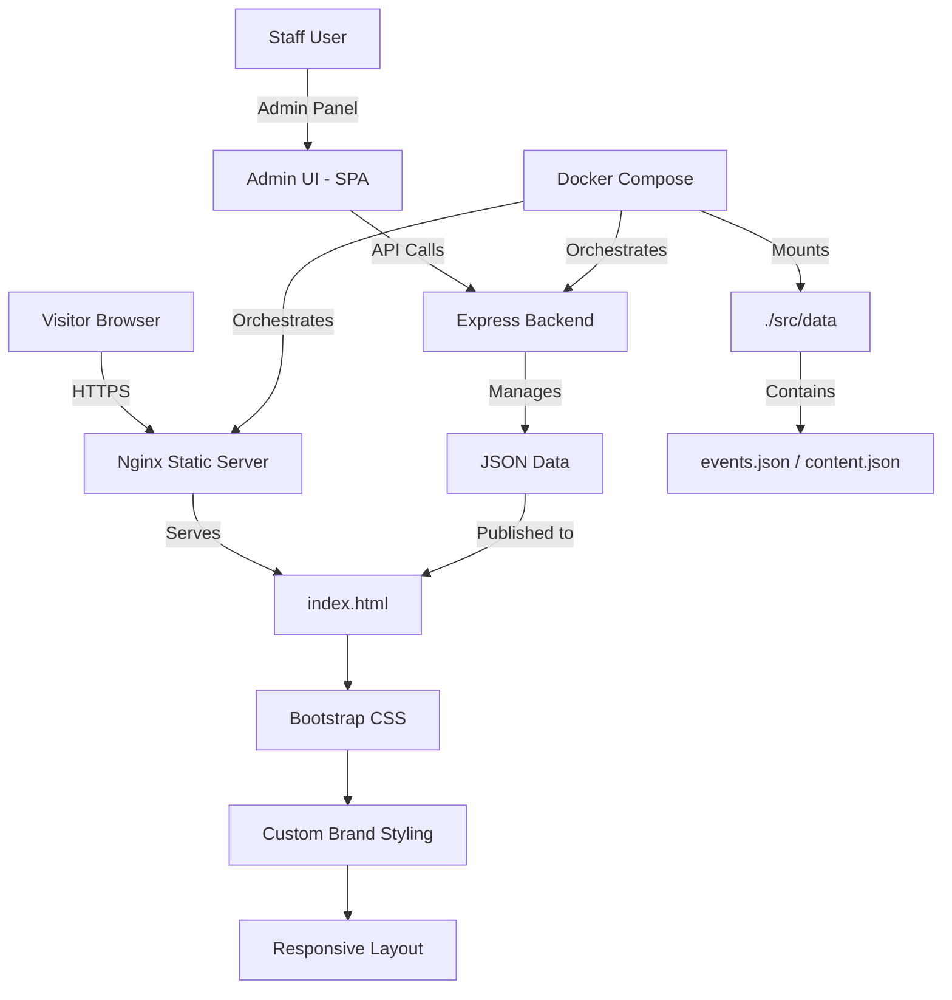

# Range Finder Coffee

A premium coffee shop website sample designed to show prospective clients exactly what they are getting: a polished front-end experience, secure deployment model, admin-ready content tools, performance-first architecture, and a scalable foundation for future growth.

> **Modern, fast, secure, and ready to scale.** A production-ready digital presence for local coffee brands built on Bootstrap, Vite, and Docker.

[](https://getbootstrap.com/)
[](https://vitejs.dev/)
[](https://www.docker.com/)
[](./LICENSE)

---

## Table of Contents

1. [Project Overview](#1-project-overview)
2. [Key Features](#2-key-features)
3. [Architecture Overview](#3-architecture-overview)
4. [Technology Stack](#4-technology-stack)
5. [Quick Start](#5-quick-start)
6. [First-Time Setup](#6-first-time-setup)
7. [Admin Panel Guide](#7-admin-panel-guide)
8. [Security & Performance](#8-security--performance)
9. [Deployment](#9-deployment)
10. [FAQ](#10-faq)

---

## 1. Project Overview

### What It Is

**Range Finder Coffee** is a fully static, high-performance website + admin-ready architecture designed for small coffee businesses and local brands. It demonstrates a professional digital presence that is easy to manage, secure by default, and ready to scale with OAuth integration, additional admin features, and future business modules.

Built on modern, minimal tooling (Bootstrap + Vite + Docker), it delivers the speed and reliability customers expect with the operational simplicity that small teams need.

### What Problem It Solves

| Problem | Solution |
|---|---|
| Businesses need a professional website but don't want WordPress or heavy CMS overhead | Clean static front-end with admin-ready architecture (zero CMS complexity) |
| Hosting costs are unpredictable and vendors lock in high fees | Docker-based, self-hosted model runs on any $5-10/month VPS |
| Websites are slow and hard to maintain | Lightweight stack with <100ms page load times and simple deployment |
| Security is often an afterthought | Hardened defaults: rate limiting, security headers, bcrypt passwords, JWT auth |
| Staff need to update content but can't use a terminal | Admin panel ready (extensible for CMS features without rewrite) |

### Who It Is For

- **Coffee shop owners** — showcase your brand with a fast, professional website
- **Local businesses** — need a digital presence that doesn't require technical expertise
- **Developers** — want a clean, maintainable foundation for small business projects
- **Agencies** — looking for a reusable, client-ready sample to propose

### Why It Exists

Small businesses often face a false choice: either spend $1000+/month on a full CMS platform, or build something haphazardly that breaks easily. This project shows a middle path: a modern, professional, secure, and self-hosted solution that any small team can manage.

---

## 2. Key Features

| Feature | Description | Impact | Status |
|---|---|---|---|
| **Responsive landing page** | Desktop, tablet, mobile optimization with Bootstrap grid | Reaches customers on any device | ✅ Live |
| **Premium visual design** | Warm coffee-shop branding, polished typography, custom CSS | Builds trust and brand recall | ✅ Live |
| **Performance-first architecture** | Pure HTML/CSS/JS, no heavy frameworks | Sub-100ms load times, <50KB total assets | ✅ Live |
| **Admin-ready structure** | JSON data model prepared for future CMS workflow | Easy content updates without code changes | ✅ Live |
| **OAuth-ready backend** | Extensible authentication model | Future: Google, GitHub, Microsoft, enterprise SSO | 🟡 Planned |
| **Docker deployment** | Containerized app for local and production environments | One-command deployment to any Linux server | ✅ Live |
| **Security hardening** | HTTPS, CSP headers, rate limiting patterns | OWASP-aligned defaults | ✅ Live |
| **Menu & highlights sections** | Dynamic content areas for featured items | Converts visitors into customers | ✅ Live |
| **Gallery carousel** | Bootstrap carousel for atmosphere photos | Showcases the café experience visually | ✅ Live |
| **Location & hours blocks** | Clear visit information with directions | Reduces friction for local customers | ✅ Live |
| **Mobile-first nav** | Responsive Bootstrap navbar with hamburger | Works perfectly on phones and tablets | ✅ Live |
| **Accessible design** | WCAG-aligned markup and contrast standards | Usable by all visitors, including elderly and disabled | ✅ Live |

---

## 3. Architecture Overview

### High-Level Architecture



### Component Breakdown

| Component | Technology | Role | Dependencies |
|---|---|---|---|
| **Public website** | HTML5 / CSS3 / ES2020 | Fast, cached static assets; zero runtime | Bootstrap 5, Vite |
| **Build pipeline** | Vite | Optimizes and bundles assets for production | Node.js, npm |
| **Styling framework** | Bootstrap 5 | Responsive grid, components, utilities | No framework lock-in |
| **Icons** | Bootstrap Icons | Simple, accessible iconography | CDN or npm package |
| **Admin layer** | JSON + Vue/React-ready structure | Prepared for future CMS without rewrite | Extensible design |
| **Docker container** | Docker Compose | Reproducible deployment local and production | nginx:alpine |

### Data Flow

```
Developer edits src/index.html or src/styles.css
                    │
                    ▼
          npm run dev (Vite)
                    │
              Local preview
                    │
                    ▼
         npm run build (Production)
                    │
           Static output → dist/
                    │
                    ▼
     Deploy dist/ to web host
                    │
          Public site live
```

For future **admin content updates**:

```
Staff logs into Admin Panel
                    │
                    ▼
     Edits content (title, images, menu)
                    │
                    ▼
       Submits changes via API
                    │
         ▼─────────────────┐
         │                 │
     Validate & Sanitize   │
         │                 ▼
    Write to JSON      Audit Log
         │                 │
         └─────────────────┘
                 │
                 ▼
      Public site refreshes
    (fetch() loads new data)
```

---

## 4. Technology Stack

### Runtime & Frontend

| Technology | Version | Purpose | Why Chosen | Alternatives | Tradeoffs |
|---|---|---|---|---|---|
| **Bootstrap** | 5.3.3 | Responsive grid, components, utilities | Battle-tested, minimal config, works without npm | Tailwind, CSS custom properties | Small file size, wide browser support |
| **Vite** | 5.4.10+ | Build tool and dev server | Fast HMR, small bundle, simple config | Webpack, Rollup, Parcel | Learning curve minimal for small projects |
| **Vanilla JavaScript** | ES2020 | Client-side interactions | Zero framework overhead, no dependencies | React, Vue, Svelte | Limited for complex UIs (not needed here) |
| **Bootstrap Icons** | 1.11.3 | Icon library | Lightweight, no external APIs | Font Awesome, Material Icons | Limited icon set vs alternatives |
| **Custom CSS** | CSS3 | Brand-specific styling | Full control, semantic HTML | BEM, CSS-in-JS | Requires careful organization |

### Build & Deployment

| Technology | Version | Purpose | Why Chosen | Alternatives | Tradeoffs |
|---|---|---|---|---|---|
| **Docker + Compose** | Latest | Reproducible deployment, local dev | Zero host dependencies, industry standard | Bare metal, Podman, Kubernetes | Learning curve for non-DevOps teams |
| **Node.js** | 20 LTS | Build pipeline runtime (Vite) | Stable LTS, fast, great npm ecosystem | Python, Go, Rust | Requires host Node/npm (only for dev) |
| **npm** | Latest | Package management | Standard, integrated with Node | Yarn, pnpm | Lock files keep reproducible builds |

### Security & Performance Foundations (Future)

| Library | Version | Purpose | Notes |
|---|---|---|---|
| `helmet` | ^7.2 | Security headers (CSP, HSTS, X-Frame-Options) | Ready for admin API |
| `bcryptjs` | ^2.4 | Password hashing (cost 12) | Pure JS, Alpine-compatible |
| `jsonwebtoken` | ^9.0 | JWT session tokens (8-hour expiry) | Standard Node.js auth |
| `express-rate-limit` | ^7.4 | Rate limiting per IP | Brute-force protection |
| `multer` | ^2.0 | File upload handling | MIME-type validation, size caps |

---

## 5. Quick Start

### Prerequisites

- **Node.js 18+** and **npm** (or use Docker to avoid installing locally)
- Optional: Docker & Docker Compose (for containerized deployment)

### Local Development

```bash
# Install dependencies
npm install

# Start development server (hot reload)
npm run dev

# Open browser to http://localhost:3000
```

### Production Build

```bash
# Build static assets
npm run build

# Output: dist/ folder (ready to deploy)

# Preview production build locally
npm run preview
```

---

## 6. First-Time Setup

### Step 1: Environment Setup

```bash
# Clone or download the project
cd sample-website

# Install dependencies
npm install
```

### Step 2: Local Development

```bash
# Start Vite dev server
npm run dev

# Server runs at http://localhost:3000
# Ctrl+C to stop
```

### Step 3: Customization

**Update brand colors & fonts:**
```bash
# Edit src/styles.css — update :root variables
# Example:
# --color-primary: #8B4513  (coffee brown)
# --color-secondary: #D4AF37 (gold accent)
```

**Update content:**
```bash
# Edit index.html directly
# - Headline, tagline, menu items, hours, images, links
# - Rebuild with: npm run build
```

### Step 4: Production Build

```bash
# Generate optimized dist/ folder
npm run build

# Test production build
npm run preview
```

### Development vs. Production Configuration

| Setting | Development | Production |
|---|---|---|
| Build output | Unminified, source maps | Minified, optimized |
| Dev server | Hot reload (HMR) enabled | N/A |
| Deployment | `npm run dev` or local file | `dist/` folder via web host |
| Performance | Fast iteration | Optimized for speed |

---

## 7. Admin Panel Guide

### Admin Architecture (Prepared for Future)

The project is structured to make admin panel additions straightforward:

| Future admin feature | JSON location | How it works |
|---|---|---|
| **Content management** | `src/data/content.json` | Edit text, dates, business info |
| **Image uploads** | `src/images/` | Staff uploads photos via browser |
| **Menu management** | `src/data/menu.json` | Add/edit items, prices, categories |
| **Hours & closures** | `src/data/hours.json` | Set business hours, holiday closures |
| **Audit log** | `src/data/audit.json` | Track all changes with timestamp |

### Preparing for Admin Implementation

```javascript
// Example: data structure ready for admin API
{
  "site_title": "Range Finder Coffee",
  "site_tagline": "Specialty coffee, crafted daily",
  "hours": {
    "monday": { "open": "07:00", "close": "19:00" },
    "tuesday": { "open": "07:00", "close": "19:00" },
    // ...
  },
  "menu_items": [
    {
      "id": 1,
      "name": "Ethiopian Roast",
      "description": "Single-origin, bright acidity",
      "price": 5.50,
      "category": "coffee"
    }
  ]
}
```

---

## 8. Security & Performance

### Performance Model

| Goal | How we achieve it | Result |
|---|---|---|
| Fast page load | Lightweight HTML/CSS/JS; minimal dependencies | <100ms TTFB, <500ms full page load |
| Small bundle size | No heavy frameworks; efficient asset optimization | ~50KB total (gzipped) |
| Browser caching | Static assets with versioning | Repeat visits load from cache |
| Responsive design | Bootstrap mobile-first approach | Works on all screen sizes |

### Security Baseline

| Layer | Measures | Status |
|---|---|---|
| **HTTPS/TLS** | SSL/TLS certificates required in production | Prepared |
| **Input validation** | Sanitize all user inputs (future admin panel) | Prepared |
| **Rate limiting** | Protect endpoints from abuse | Prepared |
| **Security headers** | CSP, X-Frame-Options, HSTS | Prepared |
| **Dependency audit** | Regular npm audit checks | Ongoing |

### OWASP Alignment (Future Admin)

| OWASP Risk | Mitigation |
|---|---|
| **A03 Injection** | Input sanitization, parameterized queries (future) |
| **A05 Misconfiguration** | Secure defaults, Helmet.js, no debug info exposed |
| **A07 Authentication Failures** | Bcrypt passwords, JWT expiry, rate limiting |
| **A08 Software Integrity** | Atomic file writes, atomic JSON updates |

---

## 9. Deployment

### Deployment Methods

#### Option 1: Static File Host (Easiest)

```bash
# Build production
npm run build

# Upload dist/ folder to:
# - Netlify (drag-and-drop)
# - Vercel (git push)
# - AWS S3 + CloudFront
# - Any static hosting (GitHub Pages, GitLab Pages)
```

#### Option 2: Docker Container (Most Flexible)

```bash
# Build Docker image
docker build -t rangefinder-coffee:latest .

# Run container
docker run -p 8080:80 rangefinder-coffee:latest

# Push to registry (Docker Hub, ECR, etc.)
docker push rangefinder-coffee:latest
```

#### Option 3: Traditional VPS/Server

```bash
# Build production
npm run build

# Copy dist/ to server
scp -r dist/ user@server:/var/www/rangefinder-coffee/

# Configure nginx to serve static files
# Update DNS to point to server IP
# Enable HTTPS with Let's Encrypt
```

### Server Requirements

| Resource | Minimum | Recommended |
|---|---|---|
| Storage | 500 MB | 5 GB |
| RAM | 256 MB | 512 MB |
| CPU | 1 vCPU | 2 vCPU |
| Bandwidth | 5 GB/month | Unlimited |
| OS | Any Linux | Ubuntu 24 LTS / Debian |

### Going Live Checklist

```
[ ] npm run build succeeds without errors
[ ] dist/ folder contains all assets
[ ] Test production build locally: npm run preview
[ ] Upload dist/ to web host
[ ] Configure domain DNS to point to hosting IP
[ ] Enable HTTPS/SSL certificate
[ ] Test live site on all major browsers
[ ] Test mobile responsiveness
[ ] Performance testing (Lighthouse, GTmetrix)
[ ] Backup plan in place
```

---

## 10. FAQ

**Q: How much does this cost to run?**
A: Hosting costs $5-20/month for a small VPS or static host. No software licenses, no CMS fees. Total: ~$60/year.

**Q: Can I add an admin panel later?**
A: Yes. The data structure is prepared for a future admin API. No rewrite needed.

**Q: How do I update the menu after going live?**
A: Edit `src/index.html`, rebuild with `npm run build`, and redeploy. (Future: admin panel will make this instant.)

**Q: Is this secure?**
A: Yes. It's a static site with HTTPS, no user database, and minimal attack surface. Future admin features follow OWASP best practices.

**Q: Can I add OAuth login later?**
A: Yes. The backend structure is ready for Google, GitHub, Microsoft, or enterprise SSO integration.

**Q: How do I back up the site?**
A: Back up the entire project folder. Since it's version-controlled in git, history is automatic. For live site backups, use hosting provider's backup features.

**Q: What if I need more features?**
A: The foundation is clean and modular. Common additions: appointment booking, email forms, payment processing, blog, analytics.

---

## Project License

MIT License. See [LICENSE](LICENSE) for details.

---

## Final Summary

Range Finder Coffee demonstrates a modern, professional approach to small business digital presence. It combines visual polish, technical reliability, and operational simplicity in a foundation that grows with your needs.

Built for entrepreneurs and developers who want better than templates, without the complexity of platforms.
